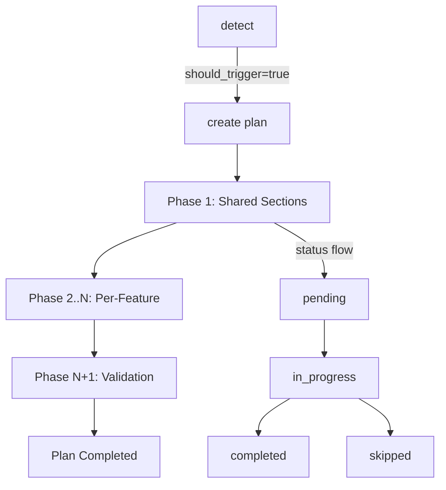

# Split-Mode Generation Protocol

> Code refs: `plan-actions.ts`, `plan-state.ts`, `manifest-schemas.ts`, `plan-phase-template.ts`, `merge-documents.ts`

## Overview

Split-mode generates large documents (basic-design, detail-design, test-specs) as multiple per-feature files instead of one monolithic file. A plan orchestrates phased generation: shared sections first, then per-feature sections, then cross-reference validation.

## Trigger Conditions

| Condition | Check | Source |
|-----------|-------|--------|
| Doc type supports split | `SPLIT_ALLOWED` set | `generate.ts:434` |
| Config has split entry | `split.{doc-type}.enabled` in `sekkei.config.yaml` | `plan-actions.ts:54-77` |
| Feature count >= 3 | Count `## ` headers in `functions-list.md` | `plan-actions.ts:248-257` |
| No active plan | No pending/in_progress plan for same doc-type | `plan-state.ts:169-195` |

**Supported doc types:** `basic-design`, `detail-design`, `ut-spec`, `it-spec`

Use `manage_plan(action="detect")` to check all conditions programmatically.

## Manifest Schema (`_index.yaml`)

Validated by Zod schemas in `manifest-schemas.ts`.

### ManifestSchema

| Field | Type | Required | Description |
|-------|------|----------|-------------|
| `version` | string | default `"1.0"` | Schema version |
| `project` | string (max 200) | yes | Project name |
| `language` | enum `ja\|en\|vi` | yes | Output language |
| `documents` | Record<string, SplitDocument> | yes | Per-doc-type split config |
| `translations` | array | no | Translation manifests |

### SplitDocumentSchema

| Field | Type | Default | Description |
|-------|------|---------|-------------|
| `type` | `"split"` | — | Always "split" |
| `status` | `pending\|in-progress\|complete` | — | Generation status |
| `shared` | SharedEntry[] | — | System-wide sections |
| `features` | FeatureEntry[] | — | Per-feature files |
| `merge_order` | `["shared","features"]` | `["shared","features"]` | Merge concatenation order |

### ManifestFeatureEntrySchema

| Field | Type | Constraint | Description |
|-------|------|------------|-------------|
| `name` | string | `/^[a-z][a-z0-9-]{1,49}$/` | Kebab-case feature ID |
| `display` | string | max 200 | Human-readable name |
| `file` | string | max 500 | Relative path to feature file |

## Naming Conventions

- **Feature ID:** kebab-case, 1-50 chars, regex `/^[a-z][a-z0-9-]{1,49}$/`
- **Feature ID prefix:** uppercase initials for cross-ref IDs (e.g., `sales-mgmt` -> `SM`, used as `SM-SCR-001`)
- **Phase files:** `phase-{NN}-{feature-id}.md` (NN = zero-padded number)
- **Shared output:** `03-system/{doc-type}.md`
- **Feature output:** `05-features/{feature-id}/{doc-type}.md`
- **Validation phase:** `phase-final-validation.md` (always last, filename never changes)

## Phase Lifecycle



**Phase types and numbering:**

| Type | Number | Count | Description |
|------|--------|-------|-------------|
| `shared` | 1 | 0-1 | System-wide sections (absent for test-spec) |
| `per-feature` | 2..N | N features | One phase per feature, sorted by priority |
| `validation` | N+1 | 1 | Cross-reference validation (always last) |

## Shared vs Feature Sections by Doc-Type

From `plan-actions.ts:34-50`:

| Doc Type | Shared Sections | Feature Sections |
|----------|----------------|-----------------|
| basic-design | system-architecture, database-design, external-interface, non-functional-design, technology-rationale | basic-design.md, screen-design.md |
| detail-design | system-architecture, database-design | module-design, class-design, api-detail, processing-flow |
| test-spec | _(none — no shared phase)_ | unit-test, integration-test, system-test, acceptance-test |

## Merge Behavior

`mergeFromManifest()` in `merge-documents.ts`:

1. Read manifest's `merge_order` (default: `["shared", "features"]`)
2. For each section type in order:
   - Read file content from manifest paths
   - Strip per-file YAML frontmatter (`---\n...\n---`)
   - Concatenate with separator comments
3. Path containment validation: all file paths must resolve within workspace directory (prevents directory traversal via manifest)
4. Output: single merged markdown document

## add_feature Flow

When new features are discovered mid-generation:

```
manage_plan(action="add_feature", plan_id, new_features)
  → validate: plan not completed/cancelled
  → validate: no duplicate feature IDs
  → gap numbering: new phases inserted after last per-feature phase
  → validation phase number updated in-memory (file stays phase-final-validation.md)
  → new phase files written to disk
  → plan.md regenerated with updated phase table
```

**Gap numbering:** New per-feature phases get numbers after the last existing per-feature phase. The validation phase's number updates in plan.md only — no file rename needed.

## Validation Rules

- **Cross-reference IDs:** Feature-scoped IDs must use the feature prefix (e.g., `SM-SCR-001` for sales-mgmt feature)
- **Manifest completeness:** Every feature in plan must have a corresponding manifest entry
- **Phase status progression:** `pending` -> `in_progress` -> `completed` (or `skipped`). No backward transitions.
- **Plan auto-completion:** When all phases reach `completed`/`skipped`, plan status transitions to `completed`

## Examples

### basic-design with 4 features

**Phase list:**
```
Phase 1: Shared Sections (shared)        → phase-01-shared-sections.md
Phase 2: Sales Management (per-feature)  → phase-02-sales-mgmt.md
Phase 3: Inventory (per-feature)         → phase-03-inventory.md
Phase 4: Reports (per-feature)           → phase-04-reports.md
Phase 5: Notifications (per-feature)     → phase-05-notifications.md
Phase 6: Validation (validation)         → phase-final-validation.md
```

**File tree:**
```
workspace-docs/
├── plans/
│   └── 20260225-basic-design-generation/
│       ├── plan.md
│       ├── phase-01-shared-sections.md
│       ├── phase-02-sales-mgmt.md
│       └── ...
├── 03-system/
│   └── basic-design.md          ← shared output
├── 05-features/
│   ├── sales-mgmt/
│   │   └── basic-design.md      ← feature output
│   ├── inventory/
│   │   └── basic-design.md
│   └── ...
└── _index.yaml                   ← manifest
```

### Manifest YAML (detail-design, 3 features)

```yaml
version: "1.0"
project: "EC Site"
language: ja
documents:
  detail-design:
    type: split
    status: in-progress
    shared:
      - file: "03-system/detail-design.md"
        section: system-architecture
        title: "システムアーキテクチャ"
    features:
      - name: sales-mgmt
        display: "販売管理"
        file: "05-features/sales-mgmt/detail-design.md"
      - name: inventory
        display: "在庫管理"
        file: "05-features/inventory/detail-design.md"
      - name: reports
        display: "レポート"
        file: "05-features/reports/detail-design.md"
    merge_order: ["shared", "features"]
```

See also: [Plan Orchestrator Reference](../packages/skills/content/references/plan-orchestrator.md) for survey flow details.
