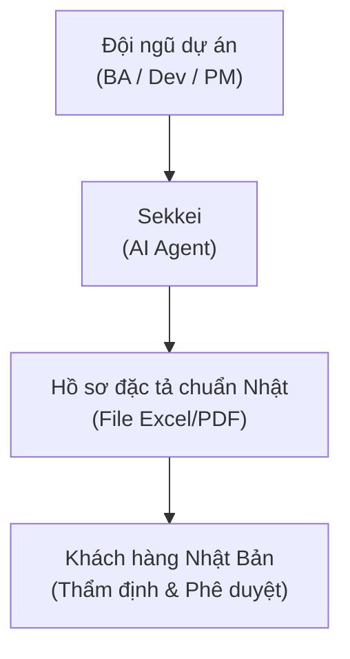

# Giới thiệu về Sekkei

## Sekkei là gì?

**Sekkei** (設計 - Thiết kế, phát âm: "sek-kei") là một AI agent chuyên sâu hoạt động trong môi trường **Claude Code**. Nhiệm vụ chính của Sekkei là hỗ trợ bạn khởi tạo bộ hồ sơ đặc tả phần mềm bằng tiếng Nhật, tuân thủ tuyệt đối các tiêu chuẩn của **IPA** (Cục Xúc tiến Công nghệ Thông tin Nhật Bản - Information-technology Promotion Agency).

Thay vì phải tiêu tốn hàng tuần để soạn thảo thủ công hàng trăm trang tài liệu tiếng Nhật — một công việc đòi hỏi sự tỉ mỉ và am hiểu sâu sắc về thuật ngữ chuyên ngành — bạn chỉ cần cung cấp yêu cầu bằng tiếng Việt hoặc tiếng Anh. Sekkei sẽ tự động chuyển hóa các ý tưởng đó thành bộ tài liệu chuyên nghiệp, đúng định dạng và văn hóa làm việc của khách hàng Nhật Bản.

**Bộ hồ sơ đầu ra bao gồm 13 loại tài liệu cốt lõi:**

| Nhóm | Danh sách tài liệu |
|------|----------|
| **Yêu cầu (Requirements)** | 要件定義書 (Định nghĩa yêu cầu), 機能一覧 (Danh sách chức năng), 非機能要件定義書 (Định nghĩa yêu cầu phi chức năng), プロジェクト計画書 (Kế hoạch dự án) |
| **Thiết kế (Design)** | 基本設計書 (Thiết kế cơ bản), セキュリティ設計書 (Thiết kế bảo mật), 詳細設計書 (Thiết kế chi tiết) |
| **Kiểm thử (Test)** | テスト計画書 (Kế hoạch kiểm thử), 単体テスト仕様書 (Đặc tả kiểm thử đơn vị), 結合テスト仕様書 (Đặc tả kiểm thử tích hợp), システムテスト仕様書 (Đặc tả kiểm thử hệ thống), 受入テスト仕様書 (Đặc tả kiểm thử nghiệm thu) |
| **Thay đổi (Change)** | 変更要求書 (Yêu cầu thay đổi) |

## Tại sao kết quả đầu ra lại là tiếng Nhật chuẩn IPA?

Tiêu chuẩn IPA là "ngôn ngữ chung" trong ngành IT tại Nhật Bản từ nhiều thập kỷ qua. Việc cung cấp bộ tài liệu đúng chuẩn này không chỉ giúp khách hàng nắm bắt thông tin cực nhanh mà còn khẳng định sự chuyên nghiệp và cam kết chất lượng của đội ngũ phát triển. Điều này giúp rút ngắn đáng kể quá trình phê duyệt và giảm thiểu các yêu cầu sửa đổi do hiểu lầm về nghiệp vụ.

Sekkei giúp các đội ngũ tại Việt Nam **tự tin soạn thảo hồ sơ chuẩn Nhật** mà không còn bị rào cản ngôn ngữ cản trở, đồng thời giảm bớt gánh nặng biên dịch cho các vị trí BA tiếng Nhật.

## Quy trình vận hành

## Đối tượng sử dụng chính

| Vai trò | Cách Sekkei hỗ trợ bạn |
|------|----------------------|
| **Phân tích nghiệp vụ (BA)** | Khởi tạo **Định nghĩa yêu cầu**, **Danh sách chức năng** và các yêu cầu phi chức năng từ ghi chú họp hoặc hồ sơ thầu (RFP). |
| **Sales / Pre-sales** | Phân tích nhanh hồ sơ thầu, tạo đề xuất (Proposal) và chốt phạm vi công việc nhanh chóng với lệnh `/sekkei:rfp`. |
| **Quản trị dự án (PM)** | Lập **Kế hoạch dự án** chuẩn xác và theo dõi trạng thái hoàn thiện hồ sơ thông qua lệnh `/sekkei:status`. |
| **Trưởng nhóm kỹ thuật (Dev Lead)** | Xây dựng các bản **Thiết kế cơ bản**, **Thiết kế chi tiết** và **Thiết kế bảo mật** một cách hệ thống. |
| **Kiểm thử (QA)** | Tự động sinh **Kế hoạch kiểm thử** và các bộ đặc tả kiểm thử tương ứng cho từng cấp độ (UT/IT/ST/UAT). |

## Những giá trị vượt trội

- **Tiết kiệm 60–80% thời gian**: Hoàn tất bộ hồ sơ đặc tả phức tạp chỉ trong vài giờ thay vì vài tuần.
- **Tính nhất quán tuyệt đối (Cross-reference)**: Mọi mã định danh (ID) từ Yêu cầu đến Chức năng, Giao diện và Kiểm thử đều được liên kết chặt chẽ và nhất quán.
- **Xác thực thông minh (Validation)**: Tự động rà soát sai sót, thiếu hụt hoặc mâu thuẫn giữa các tài liệu trước khi bàn giao.
- **Xuất bản chuẩn IPA**: Tự động tạo file Excel với đầy đủ 4 sheet tiêu chuẩn: **Trang bìa (表紙)**, **Lịch sử sửa đổi (更新履歴)**, **Mục lục (目次)** và **Nội dung chính (本文)**.

## Môi trường hỗ trợ

Sekkei hiện đã sẵn sàng tích hợp trên các nền tảng lập trình phổ biến: **Claude Code** (Hỗ trợ chính thức), **Cursor** và **GitHub Copilot**.

## Lưu ý quan trọng

> [!WARNING]
> Sekkei đóng vai trò là "công cụ hỗ trợ đắc lực", không thay thế hoàn toàn năng lực nghiệp vụ của con người. Mọi kết quả do AI tạo ra **cần được rà soát kỹ lưỡng** bởi các chuyên gia trong nhóm trước khi chính thức gửi tới đối tác.

- Luôn sử dụng lệnh `/sekkei:validate` để đảm bảo tính nhất quán của hệ thống mã ID.
- Hãy chủ động cung cấp các thông số đặc thù của dự án (như cam kết SLA, hạ tầng cụ thể) để AI đưa ra kết quả sát thực tế nhất.
- Bạn có thể tùy chỉnh mức độ kính ngữ (**敬語 - Keigo**) trong file cấu hình để phù hợp với văn hóa riêng biệt của từng khách hàng.

---

**Bước tiếp theo:** Hãy tham khảo hướng dẫn [Bắt đầu nhanh (Quick Start)](./03-quick-start.md) để khởi tạo tài liệu chuẩn Nhật đầu tiên chỉ trong 15 phút.
 Proudly presented by Antigravity.
 Proudly presented by Antigravity.
