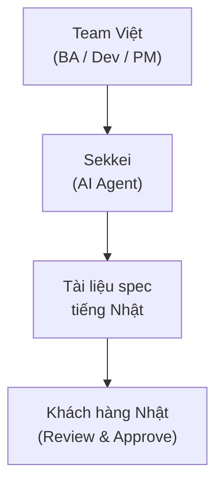
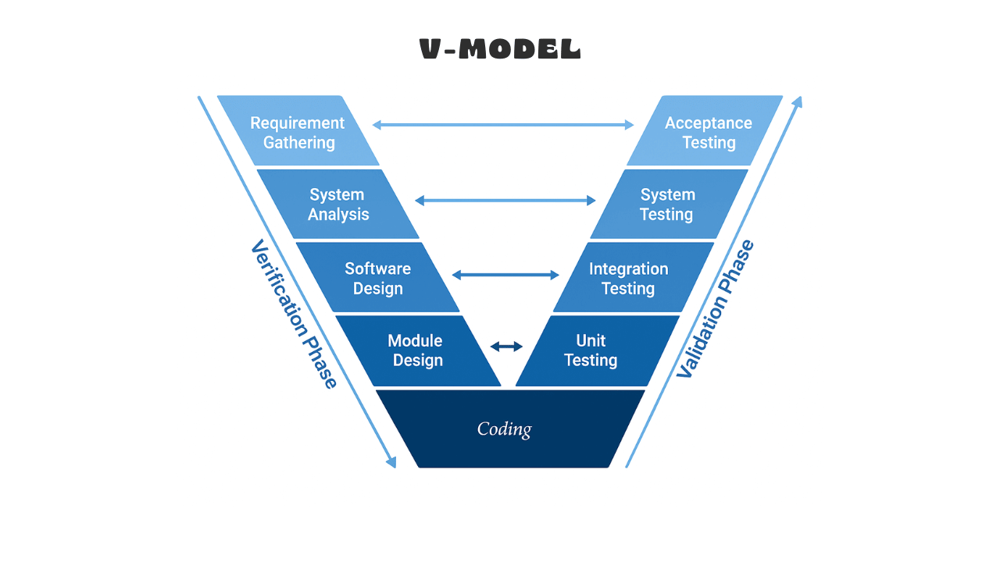

# Giới thiệu Sekkei

## Sekkei là gì?

**Sekkei** (設計, phát âm: "sek-kei") là một AI agent chạy trong **Claude Code** giúp bạn tạo tài liệu đặc tả phần mềm (specification documents) bằng tiếng Nhật theo chuẩn **IPA** (Information-technology Promotion Agency).

Thay vì viết tay từng trang tài liệu tiếng Nhật — vốn tốn nhiều thời gian và dễ sai chuyên ngành — bạn chỉ cần mô tả yêu cầu bằng tiếng Việt hay tiếng Anh, Sekkei sẽ sinh ra bộ tài liệu hoàn chỉnh theo đúng định dạng mà khách hàng Nhật yêu cầu.

**Output gồm 13 loại tài liệu chính:**

| Nhóm | Tài liệu |
|------|----------|
| Yêu cầu | 要件定義書, 機能一覧, 非機能要件定義書, プロジェクト計画書 |
| Thiết kế | 基本設計書, セキュリティ設計書, 詳細設計書 |
| Test | テスト計画書, 単体テスト仕様書, 結合テスト仕様書, システムテスト仕様書, 受入テスト仕様書 |
| Thay đổi | 変更要求書 |

## Tại sao output tiếng Nhật?

Khách hàng Nhật yêu cầu tài liệu theo **chuẩn IPA** — một bộ quy chuẩn về định dạng, cấu trúc, và thuật ngữ mà các công ty IT Nhật đã quen dùng từ thập niên 1990. Khi bạn nộp tài liệu theo chuẩn này, khách hàng đọc nhanh hơn, duyệt nhanh hơn, và ít yêu cầu sửa đổi hơn.

Sekkei giúp team Việt **viết spec bằng tiếng Nhật đúng chuẩn** mà không cần tự dịch thủ công hay thuê thêm BA biết tiếng Nhật.

## Luồng hoạt động

## Ai dùng được?

| Role | Dùng Sekkei để làm gì |
|------|----------------------|
| **BA** | Tạo 要件定義書, 機能一覧, 非機能要件定義書 từ meeting notes hoặc RFP |
| **Sales / Pre-sales** | Chạy `/sekkei:rfp` để phân tích RFP, tạo proposal, đóng băng scope trước khi ký hợp đồng |
| **PM** | Tạo プロジェクト計画書, theo dõi tiến độ chain với `/sekkei:status` |
| **Dev Lead** | Tạo 基本設計書, 詳細設計書, セキュリティ設計書 từ requirements |
| **QA** | Tạo テスト計画書 và 4 loại test spec (UT/IT/ST/UAT) |

## Value proposition

- **Tiết kiệm 60–80% thời gian** viết spec — thay vì mất 2–3 ngày cho 要件定義書, bạn chỉ cần 30–60 phút
- **Cross-reference IDs tự động** — REQ-001 → F-001 → SCR-001 → UT-001 được liên kết nhất quán xuyên suốt bộ tài liệu
- **Chain validation** — phát hiện ID bị broken hoặc thiếu section trước khi gửi khách hàng
- **IPA 4-sheet Excel** — export đúng format 表紙 / 更新履歴 / 目次 / 本文 mà không cần format tay

## Môi trường hỗ trợ

| Môi trường | Trạng thái |
|-----------|-----------|
| **Claude Code** | Chính thức (primary) |
| Cursor | Hỗ trợ (via `mcp.json`) |
| GitHub Copilot | Hỗ trợ (via `copilot-instructions.md`) |

## Giới hạn cần biết

> [!WARNING]
> Sekkei **không thay thế domain knowledge**. Output AI cần được review kỹ bởi người có hiểu biết về nghiệp vụ (BA hoặc domain expert) trước khi gửi khách hàng.

- AI có thể tạo ID không nhất quán nếu input không đầy đủ — dùng `/sekkei:validate` để kiểm tra
- Sekkei không tự động điền số liệu nghiệp vụ cụ thể (VD: mức SLA, ngân sách) — bạn phải cung cấp
- Output tiếng Nhật có thể cần chỉnh sửa keigo (敬語) cho phù hợp phong cách khách hàng

## 3 Thuật ngữ cần biết trước

### V-model

Mô hình phát triển phần mềm phổ biến tại Nhật, trong đó mỗi tài liệu thiết kế (bên trái) đối ứng với một loại test (bên phải). Sekkei sinh tài liệu theo đúng thứ tự V-model này.

Chi tiết xem: [V-model và 13 loại tài liệu](./02-v-model-and-documents.md)

### IPA標準 (IPA chuẩn)

Bộ quy chuẩn tài liệu do **Information-technology Promotion Agency** của Nhật ban hành. Quy định cấu trúc, tên section, định dạng bảng, và cách đánh số ID. Sekkei tuân theo chuẩn này cho toàn bộ output.

### Chain (Chuỗi tài liệu phụ thuộc)

Các tài liệu trong Sekkei **phụ thuộc lẫn nhau theo thứ tự**. Ví dụ: 基本設計書 cần 要件定義書 làm input; 詳細設計書 cần 基本設計書. Nếu bỏ qua bước giữa, tài liệu sau sẽ thiếu cross-reference IDs.

---

**Bước tiếp theo:** Đọc [Quick Start](./03-quick-start.md) để tạo tài liệu đầu tiên trong 15 phút.
