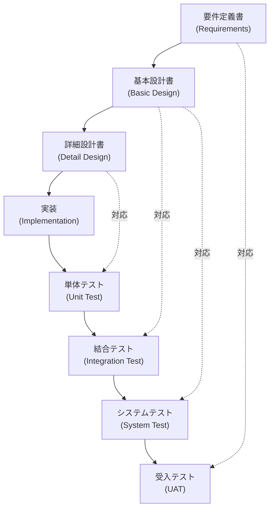
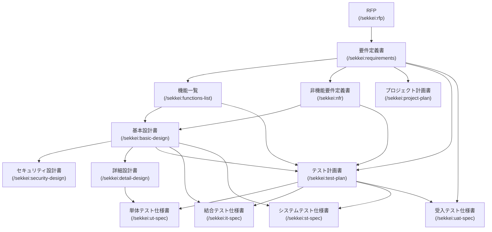
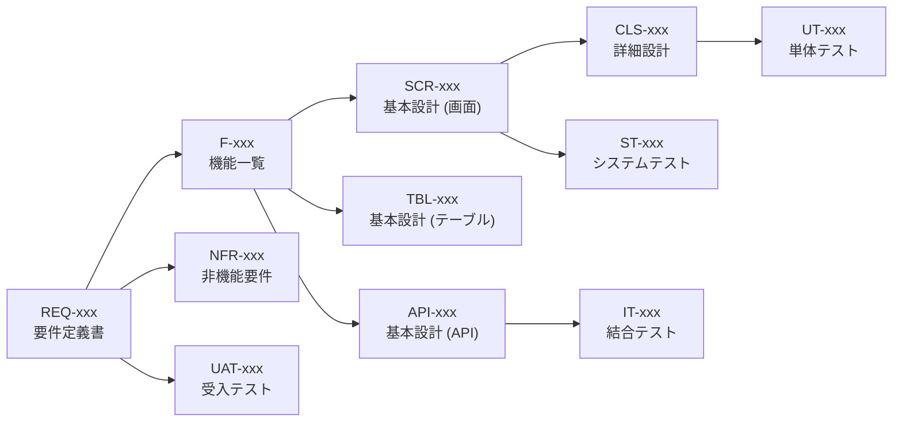

# V-Model và 13 Loại Tài Liệu

## Section 1: V-Model là gì?

**V-model** (V字モデル) là mô hình phát triển phần mềm tiêu chuẩn tại Nhật, trong đó mỗi tài liệu **đặc tả** (bên trái chữ V) đối ứng trực tiếp với một loại **test** (bên phải chữ V). Khi code xong, bạn leo lên bên phải, verify từng cấp theo đúng tài liệu đã viết ở cấp tương ứng.



Điều này có nghĩa: nếu bạn viết 要件定義書 kỹ, thì khi viết 受入テスト仕様書 sau này sẽ dễ dàng — vì UAT verify đúng những gì REQ-xxx đã cam kết.

### Cross-Reference ID System

Sekkei dùng hệ thống **ID xuyên suốt** để liên kết tài liệu:

```
REQ-001 (yêu cầu) → F-001 (tính năng) → SCR-001 (màn hình) → UT-001 (unit test)
```

Khi bạn thay đổi REQ-001, Sekkei có thể trace xem F-xxx, SCR-xxx, UT-xxx nào bị ảnh hưởng.

---

## Section 2: 13 Loại Tài Liệu Cốt Lõi

### Chain phụ thuộc



---

#### 1. Tài liệu Đặc tả Yêu cầu — 要件定義書

- **Là gì:** Tài liệu gốc mô tả **khách hàng muốn gì** — phạm vi hệ thống, yêu cầu chức năng, yêu cầu phi chức năng, và tiêu chí nghiệm thu. Đây là tài liệu quan trọng nhất trong chain.
- **Ai tạo:** BA | **Ai review:** PM + khách hàng Nhật
- **Khi nào:** Sau khi có RFP hoặc họp kickoff với khách hàng
- **Input cần:** RFP, meeting notes, hoặc mô tả yêu cầu từ khách hàng
- **Output:** `sekkei-docs/requirements.md` — IDs: `REQ-001`, `NFR-001`
- **Lệnh:**
  ```
  /sekkei:requirements @rfp-notes.md
  ```
  Ví dụ với HR system: BA mô tả "Hệ thống quản lý nhân sự (人事管理システム) cần quản lý hồ sơ nhân viên, chấm công, tính lương", Sekkei sẽ sinh ra 要件定義書 gồm 10 sections với REQ-001 đến REQ-050 và các tiêu chí nghiệm thu tương ứng.

---

#### 2. Danh sách Chức năng — 機能一覧

- **Là gì:** Bảng liệt kê **toàn bộ chức năng** của hệ thống theo cấu trúc 3 tầng: 大分類 (nhóm lớn) → 中分類 (nhóm vừa) → 小機能 (chức năng cụ thể). Dùng để estimate, phân công, và track progress.
- **Ai tạo:** BA | **Ai review:** Dev Lead + PM
- **Khi nào:** Song song hoặc ngay sau 要件定義書
- **Input cần:** 要件定義書 hoặc RFP
- **Output:** `sekkei-docs/functions-list.md` — IDs: `F-001` (ví dụ: `EMP-001` cho nhóm Employee)
- **Lệnh:**
  ```
  /sekkei:functions-list @requirements.md
  ```
  Ví dụ: Nhóm 大分類 "従業員管理" (Quản lý nhân viên) → 中分類 "基本情報管理" → 小機能 "社員情報登録" (F-001), "社員情報更新" (F-002), "社員情報削除" (F-003).

> [!TIP]
> Nếu 機能一覧 có từ 3 nhóm 大分類 trở lên, Sekkei sẽ hỏi bạn có muốn bật **split mode** không — sinh tài liệu riêng cho từng feature group thay vì một file monolithic khổng lồ.

---

#### 3. Tài liệu Yêu cầu Phi chức năng — 非機能要件定義書

- **Là gì:** Mô tả **các ràng buộc kỹ thuật** không phải chức năng: hiệu năng (response time, throughput), khả dụng (uptime %), bảo mật, khả năng mở rộng, khả năng bảo trì. **Mọi chỉ số phải là con số cụ thể** — không được viết mơ hồ như "hệ thống phải nhanh".
- **Ai tạo:** BA + Dev Lead | **Ai review:** PM + khách hàng Nhật
- **Khi nào:** Cùng lúc với 要件定義書
- **Input cần:** 要件定義書
- **Output:** `sekkei-docs/nfr.md` — IDs: `NFR-001`
- **Lệnh:**
  ```
  /sekkei:nfr @requirements.md
  ```
  Ví dụ: NFR-001 "画面表示応答時間: 3秒以内 (95パーセンタイル)", NFR-002 "システム稼働率: 99.5%以上 (月次計算)".

---

#### 4. Kế hoạch Dự án — プロジェクト計画書

- **Là gì:** Tài liệu lập kế hoạch dự án gồm WBS (Work Breakdown Structure), milestones, phân công nhân lực, và timeline. Khách hàng Nhật thường yêu cầu tài liệu này trước khi ký hợp đồng.
- **Ai tạo:** PM | **Ai review:** Dev Lead + khách hàng Nhật
- **Khi nào:** Sau khi có 要件定義書 và 機能一覧
- **Input cần:** 要件定義書, 機能一覧
- **Output:** `sekkei-docs/project-plan.md` — IDs: `PP-001`
- **Lệnh:**
  ```
  /sekkei:project-plan @requirements.md
  ```
  Ví dụ: PP-001 "要件定義フェーズ: 2024/04/01〜2024/04/14, 担当: BA チーム".

---

#### 5. Tài liệu Thiết kế Cơ bản — 基本設計書

- **Là gì:** Tài liệu **thiết kế mức cao** mô tả kiến trúc hệ thống, danh sách màn hình, định nghĩa database, danh sách API, và luồng nghiệp vụ chính. Đây là tài liệu pivot — downstream docs (詳細設計書, test specs) đều phụ thuộc vào nó.
- **Ai tạo:** Dev Lead | **Ai review:** PM + BA + khách hàng Nhật
- **Khi nào:** Sau khi 要件定義書, 機能一覧, NFR hoàn chỉnh
- **Input cần:** 要件定義書, 機能一覧
- **Output:** `sekkei-docs/basic-design.md` — IDs: `SCR-001` (màn hình), `TBL-001` (bảng DB), `API-001` (API)
- **Lệnh:**
  ```
  /sekkei:basic-design @requirements.md
  ```
  Ví dụ: SCR-001 "ログイン画面", TBL-001 "社員マスタ (employees)", API-001 "GET /api/employees/{id}".

---

#### 6. Tài liệu Thiết kế Bảo mật — セキュリティ設計書

- **Là gì:** Mô tả **cách bảo vệ hệ thống** theo OWASP Top 10, bao gồm authentication, authorization, mã hóa dữ liệu, và compliance (GDPR, 個人情報保護法). Yêu cầu TLS 1.3+, bcrypt cost≥12 hoặc Argon2id cho password.
- **Ai tạo:** Dev Lead + Security | **Ai review:** PM + khách hàng Nhật
- **Khi nào:** Sau khi có 基本設計書
- **Input cần:** 基本設計書, 要件定義書, NFR
- **Output:** `sekkei-docs/security-design.md` — IDs: `SEC-001`
- **Lệnh:**
  ```
  /sekkei:security-design @basic-design.md
  ```
  Ví dụ: SEC-001 "認証方式: OAuth 2.0 + JWT (RS256, 有効期限1時間)", SEC-002 "パスワードハッシュ: bcrypt (cost=12)".

---

#### 7. Tài liệu Thiết kế Chi tiết — 詳細設計書

- **Là gì:** Tài liệu **thiết kế mức thấp** dành cho developer — mô tả class diagram, sequence diagram, xử lý logic từng module, validation rules, error codes. Developer đọc là có thể code được.
- **Ai tạo:** Dev Lead / Senior Dev | **Ai review:** Dev team
- **Khi nào:** Sau khi có 基本設計書
- **Input cần:** 基本設計書, 要件定義書, 機能一覧
- **Output:** `sekkei-docs/detail-design.md` — IDs: `CLS-001` (class)
- **Lệnh:**
  ```
  /sekkei:detail-design @basic-design.md
  ```
  Ví dụ: CLS-001 "EmployeeService: +findById(id: string): Employee, +update(id: string, dto: UpdateEmployeeDto): void" với sequence diagram cho luồng cập nhật nhân viên.

---

#### 8. Kế hoạch Kiểm thử — テスト計画書

- **Là gì:** Tài liệu chiến lược test tổng thể — xác định phạm vi test, môi trường, công cụ, entry/exit criteria cho cả 4 cấp (UT, IT, ST, UAT). Là "master plan" mà các test spec (UT/IT/ST/UAT) sẽ tuân theo.
- **Ai tạo:** QA Lead | **Ai review:** PM + Dev Lead
- **Khi nào:** Sau khi có 要件定義書 — có thể bắt đầu song song với 基本設計書
- **Input cần:** 要件定義書, NFR, 機能一覧, 基本設計書 (nếu có)
- **Output:** `sekkei-docs/test-plan.md` — IDs: `TP-001`
- **Lệnh:**
  ```
  /sekkei:test-plan @requirements.md
  ```
  Ví dụ: TP-001 "単体テスト Exit Criteria: カバレッジ80%以上, 全テストケース合格".

---

#### 9. Đặc tả Kiểm thử Đơn vị — 単体テスト仕様書

- **Là gì:** Test cases cho **từng class/function** — test theo 3 loại: 正常系 (happy path), 異常系 (error cases), 境界値 (boundary values). Mỗi module cần tối thiểu 5 test cases.
- **Ai tạo:** Developer | **Ai review:** QA
- **Khi nào:** Sau khi có 詳細設計書
- **Input cần:** 詳細設計書, テスト計画書
- **Output:** `sekkei-docs/ut-spec.md` — IDs: `UT-001`
- **Lệnh:**
  ```
  /sekkei:ut-spec @detail-design.md
  ```
  Ví dụ: UT-001 "EmployeeService.findById() 正常系: 存在するIDで社員情報が返却される", UT-002 "EmployeeService.findById() 異常系: 存在しないIDで404エラーが返却される".

---

#### 10. Đặc tả Kiểm thử Tích hợp — 結合テスト仕様書

- **Là gì:** Test cases kiểm tra **giao tiếp giữa các module** — API contracts, request/response schemas, error codes, tích hợp với external services. Focus vào interface, không phải nội bộ từng class.
- **Ai tạo:** QA / Dev | **Ai review:** Dev Lead
- **Khi nào:** Sau khi có 基本設計書
- **Input cần:** 基本設計書 (API-xxx, SCR-xxx), テスト計画書
- **Output:** `sekkei-docs/it-spec.md` — IDs: `IT-001`
- **Lệnh:**
  ```
  /sekkei:it-spec @basic-design.md
  ```
  Ví dụ: IT-001 "API-001 GET /api/employees/{id}: 正常系 - 200 OK + 社員オブジェクト返却", IT-002 "API-001: 異常系 - IDが文字列の場合 400 Bad Request".

---

#### 11. Đặc tả Kiểm thử Hệ thống — システムテスト仕様書

- **Là gì:** Test cases **end-to-end** kiểm tra toàn bộ hệ thống như một khối — bao gồm business scenarios, performance tests (với targets số cụ thể), và security tests. Không split theo feature.
- **Ai tạo:** QA Lead | **Ai review:** PM
- **Khi nào:** Sau khi có 基本設計書, 機能一覧, テスト計画書
- **Input cần:** 基本設計書, 機能一覧, テスト計画書
- **Output:** `sekkei-docs/st-spec.md` — IDs: `ST-001`
- **Lệnh:**
  ```
  /sekkei:st-spec @basic-design.md
  ```
  Ví dụ: ST-001 "従業員登録→承認→給与計算フローの正常系E2Eテスト", ST-050 "1000同時接続時の応答時間: 3秒以内を確認 (NFR-001)".

---

#### 12. Đặc tả Kiểm thử Nghiệm thu — 受入テスト仕様書

- **Là gì:** Test cases **từ góc nhìn khách hàng/business** — không phải technical, mà là "hệ thống có đáp ứng nhu cầu nghiệp vụ không?". Khách hàng Nhật thường tự chạy UAT và ký nghiệm thu dựa trên tài liệu này.
- **Ai tạo:** BA | **Ai review:** PM + khách hàng Nhật
- **Khi nào:** Sau khi có 要件定義書 và テスト計画書
- **Input cần:** 要件定義書, NFR, テスト計画書
- **Output:** `sekkei-docs/uat-spec.md` — IDs: `UAT-001`
- **Lệnh:**
  ```
  /sekkei:uat-spec @requirements.md
  ```
  Ví dụ: UAT-001 "人事担当者として、新入社員の情報を登録し、給与システムと連携できること (REQ-005)".

---

#### 13. Yêu cầu Thay đổi — 変更要求書

- **Là gì:** Tài liệu quản lý **thay đổi sau khi spec đã được duyệt** — mô tả nội dung thay đổi, phân tích impact, và danh sách tài liệu cần cập nhật. Giúp tránh "scope creep" không kiểm soát.
- **Ai tạo:** BA / PM | **Ai review:** Dev Lead + khách hàng Nhật
- **Khi nào:** Bất cứ khi nào có yêu cầu thay đổi sau khi spec freeze
- **Input cần:** Tài liệu bị ảnh hưởng (bất kỳ tài liệu nào trong chain)
- **Output:** `sekkei-docs/change-request.md` — IDs: `CR-001`
- **Lệnh:** Dùng `/sekkei:update @doc` để phát hiện impact, sau đó tạo 変更要求書 theo template
  ```
  /sekkei:update @basic-design.md
  ```
  Ví dụ: CR-001 "SCR-003 従業員詳細画面に「部署異動履歴」タブを追加。影響範囲: SCR-003, TBL-002, API-005, IT-012".

---

### Cross-reference ID tóm tắt



---

## Section 3: 9 Tài liệu Bổ sung

Ngoài 13 tài liệu cốt lõi, Sekkei còn hỗ trợ các tài liệu bổ sung. Các tài liệu này không bắt buộc trong mọi dự án.

| Tài liệu | Lệnh | Mô tả ngắn |
|---------|------|------------|
| **CRUD図** | `/sekkei:matrix` | Bảng function × table với C/R/U/D — giúp detect thiếu logic |
| **サイトマップ** | `/sekkei:sitemap` | Cấu trúc phân cấp toàn bộ màn hình hệ thống (PG-xxx IDs) |
| **運用設計書** | `/sekkei:operation-design` | Kế hoạch vận hành: backup, monitoring, disaster recovery, SLA |
| **移行設計書** | `/sekkei:migration-design` | Kế hoạch migrate data và cutover từ hệ thống cũ |
| **画面設計書** | (split mode, auto) | Chi tiết từng màn hình: layout, validation, events, transitions |
| **議事録** | (manual) | Biên bản cuộc họp — không sinh tự động, nhưng có thể dùng template |
| **ADR** | (manual) | Architecture Decision Records — ghi lại lý do technical decisions |
| **テストエビデンス** | (manual) | Bằng chứng thực hiện test — screenshot, log, kết quả |
| **翻訳** | `/sekkei:translate @doc --lang=en` | Dịch bất kỳ tài liệu nào sang tiếng Anh hoặc tiếng Việt |

> [!NOTE]
> **画面設計書** được sinh tự động khi bật **split mode** trong 基本設計書 — mỗi feature group sẽ có file `screen-design.md` riêng với screen mockups (PNG) nếu Playwright có sẵn.

---

## Section 4: Định dạng IPA Standard

Tất cả file export của Sekkei tuân theo **cấu trúc Excel 4 sheet** theo chuẩn IPA:

| Sheet | Nội dung | Ghi chú |
|-------|---------|---------|
| **表紙** (Cover) | Tên dự án, tên tài liệu, version, ngày tạo, tác giả | Tự động điền từ `sekkei.config.yaml` |
| **更新履歴** (Revision History) | Ngày, version, nội dung thay đổi, tác giả | Tự động thêm entry mỗi lần export |
| **目次** (Table of Contents) | Danh sách sections với số trang | Tự động generate |
| **本文** (Body) | Nội dung tài liệu với bảng, diagrams | Output chính |

### Tại sao cấu trúc này quan trọng?

Khách hàng Nhật **quen thuộc với định dạng này** từ nhiều năm. Khi nhận file Excel theo đúng 4-sheet IPA, họ biết ngay phải tìm gì ở đâu, không cần hướng dẫn thêm. Điều này tạo ấn tượng chuyên nghiệp và giảm thời gian review.

Export:
```
/sekkei:export @requirements --format=xlsx   # IPA 4-sheet Excel
/sekkei:export @requirements --format=pdf    # PDF với Noto Sans JP, A4
/sekkei:export @requirements --format=docx   # Word với TOC tự động
```

---

**Bước tiếp theo:** Xem [Quick Start](./03-quick-start.md) để bắt đầu tạo tài liệu đầu tiên, hoặc xem các workflow hướng dẫn trong thư mục `workflow/`.
