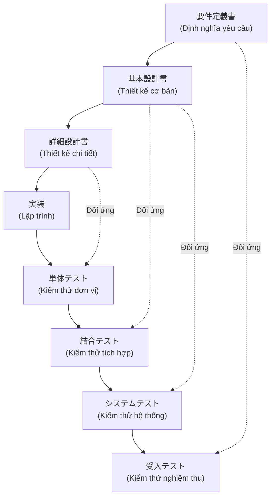
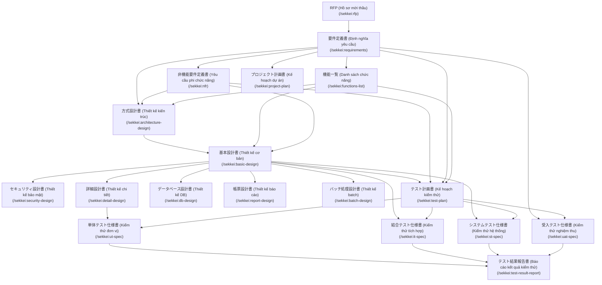
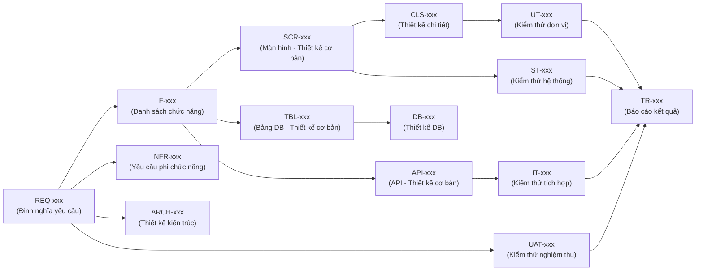

# Mô hình chữ V (V-Model) và 18 Loại Tài liệu Cốt lõi

## Phần 1: Tổng quan về Mô hình chữ V (V-Model)

**Mô hình chữ V** (V字モデル - V-Model) là tiêu chuẩn vàng trong quy trình phát triển phần mềm tại Nhật Bản. Điểm đặc trưng của mô hình này là sự đối xứng chặt chẽ: mỗi tài liệu **đặc tả** (nhánh bên trái) sẽ có một loại **kiểm thử** tương ứng (nhánh bên phải). Mục tiêu cuối cùng là đảm bảo mọi tính năng được thiết kế đều phải được kiểm chứng một cách minh bạch.



**Nguyên tắc vàng:** Độ chính xác của tài liệu **要件定義書 (Định nghĩa yêu cầu)** sẽ quyết định chất lượng của toàn bộ dự án. Khi yêu cầu được định nghĩa rõ ràng, việc xây dựng **受入テスト仕様書 (Đặc tả kiểm thử nghiệm thu - UAT)** sẽ trở nên nhất quán, giúp khách hàng dễ dàng xác nhận sản phẩm bàn giao có đúng như cam kết ban đầu hay không.

### Hệ thống truy xuất nguồn gốc (Cross-Reference ID)

Sekkei thiết lập một mạng lưới liên kết thông minh thông qua các mã ID duy nhất. Điều này giúp đội ngũ quản lý thay đổi một cách khoa học:
- **REQ-001 (Yêu cầu)** ánh xạ tới **F-001 (Chức năng)**.
- **F-001** ánh xạ tới giao diện **SCR-001 (Màn hình)**.
- **SCR-001** ánh xạ tới kịch bản kiểm thử **UT-001 (Đơn vị)**.

Nhờ đó, khi một yêu cầu (REQ) thay đổi, hệ thống sẽ tự động chỉ ra các màn hình, API và kịch bản kiểm thử nào cần phải được cập nhật theo.

---

## Phần 2: Chi tiết 18 Loại Tài liệu Cốt lõi

Dưới đây là danh mục các tài liệu theo chuẩn IPA mà Sekkei hỗ trợ khởi tạo tự động (bao gồm 方式設計書, DB設計書, 帳票設計書, バッチ処理設計書, テスト結果報告書 mới bổ sung):

### Chuỗi phụ thuộc giữa các tài liệu (Document Chain)



---

### 1. Định nghĩa Yêu cầu — 要件定義書
- **Vai trò:** Tài liệu nền tảng mô tả tầm nhìn của khách hàng, phạm vi nghiệp vụ và các tiêu chí để nghiệm thu sản phẩm.
- **Vai trò thực hiện:** BA (người soạn thảo), PM và Khách hàng (người phê duyệt).
- **Đầu vào:** Hồ sơ thầu (RFP) hoặc biên bản các cuộc họp định hướng.
- **Kết xuất:** `workspace-docs/requirements.md` (Mã định danh: `REQ-xxx`).
- **Câu lệnh:**
  ```
  /sekkei:requirements @rfp-notes.md
  ```
  *Ví dụ:* Với hệ thống quản lý nhân sự (人事管理システム), BA mô tả "Cần quản lý hồ sơ, chấm công và tính lương", Sekkei sẽ tự động sinh ra bản 要件定義書 gồm 10 phần với các mã REQ-001 đến REQ-050 kèm tiêu chí nghiệm thu tương ứng.

---

### 2. Danh sách Chức năng — 機能一覧
- **Vai trò:** Bản liệt kê chi tiết mọi tính năng của hệ thống, được phân cấp rõ ràng (Lớn → Vừa → Nhỏ/Cụ thể).
- **Cấu trúc:** 大分類 (Phân loại lớn), 中分類 (Phân loại vừa), 小機能 (Tính năng cụ thể).
- **Đầu vào:** Định nghĩa yêu cầu.
- **Kết xuất:** `workspace-docs/functions-list.md` (Mã định danh: `F-xxx`).
- **Câu lệnh:**
  ```
  /sekkei:functions-list @requirements.md
  ```
  *Ví dụ:* Phân loại lớn (大分類) "従業員管理" (Quản lý nhân viên) → Phân loại vừa (中分類) "基本情報管理" (Quản lý thông tin cơ bản) → Chức năng cụ thể (小機能) "社員情報登録" (Đăng ký thông tin nhân viên - F-001), "社員情報更新" (Cập nhật thông tin nhân viên - F-002).

> [!TIP]
> Nếu danh sách chức năng có từ 3 nhóm Phan loại lớn (大分類) trở lên, Sekkei sẽ gợi ý sử dụng **chế độ tách file (split mode)** để quản lý tài liệu theo từng nhóm tính năng thay vì một file duy nhất.

---

### 3. Định nghĩa Yêu cầu Phi chức năng — 非機能要件定義書
- **Vai trò:** Xác lập các tiêu chuẩn về hiệu năng, độ an toàn và ổn định. Các chỉ số như thời gian phản hồi, tỷ lệ hoạt động phải được định lượng chính xác (Ví dụ: "Phản hồi dưới 3 giây" thay vì "Chạy nhanh").
- **Người soạn thảo:** BA + Dev Lead | **Người phê duyệt:** PM + Khách hàng Nhật.
- **Thời điểm:** Thực hiện đồng thời với tài liệu 要件定義書.
- **Đầu vào:** Định nghĩa yêu cầu.
- **Kết xuất:** `workspace-docs/nfr.md` (Mã định danh: `NFR-xxx`).
- **Câu lệnh:**
  ```
  /sekkei:nfr @requirements.md
  ```
  *Ví dụ:* NFR-001 "画面表示応答時間 (Thời gian hiển thị màn hình): Dưới 3 giây (95th percentile)", NFR-002 "システム稼働率 (Tỷ lệ hoạt động hệ thống): Trên 99.5%".

---

### 4. Kế hoạch Dự án — プロジェクト計画書
- **Vai trò:** Bản đồ lộ trình của dự án bao gồm cấu trúc phân rã công việc (WBS), các mốc thời gian quan trọng và phương án sử dụng nhân sự.
- **Vai trò thực hiện:** PM (người soạn thảo).
- **Người phê duyệt:** Dev Lead + Khách hàng Nhật.
- **Thời điểm:** Sau khi hoàn thiện 要件定義書 và 機能一覧.
- **Thông tin đầu vào:** 要件定義書, 機能一覧.
- **Kết quả đầu ra:** `workspace-docs/project-plan.md` — Mã ID: `PP-001`.
- **Câu lệnh:**
  ```
  /sekkei:project-plan @requirements.md
  ```

---

### 5. Thiết kế Kiến trúc — 方式設計書 (MỚI)
- **Vai trò:** Tài liệu thiết kế kiến trúc cấp cao theo chuẩn IPA V-Model Layer 3, mô tả phương thức hệ thống (システム方式), phương thức phát triển (開発方式), phương thức vận hành (運用方式), cấu hình phần cứng/mạng, và lý do lựa chọn công nghệ.
- **Vai trò thực hiện:** Dev Lead / Architect (người soạn thảo), PM và Khách hàng (người phê duyệt).
- **Đầu vào:** 要件定義書, 機能一覧, 非機能要件定義書.
- **Kết xuất:** `workspace-docs/architecture-design.md` (Mã định danh: `ARCH-xxx`).
- **Câu lệnh:**
  ```
  /sekkei:architecture-design @requirements.md @nfr.md
  ```
  *Ví dụ:* ARCH-001 "Kiến trúc microservices với API Gateway", ARCH-002 "Phương thức phát triển Agile + CI/CD pipeline".

---

### 6. Thiết kế Cơ bản — 基本設計書
- **Vai trò:** Thiết kế kiến trúc tổng thể, sơ đồ cơ sở dữ liệu và danh sách màn hình. Đây là tài liệu khách hàng Nhật quan tâm nhất để hiểu về cấu trúc hệ thống.
- **Người soạn thảo:** Dev Lead | **Người phê duyệt:** PM + BA + Khách hàng Nhật.
- **Thời điểm:** Sau khi các tài liệu yêu cầu (要件, 機能, 非機能) đã hoàn chỉnh.
- **Đầu vào:** Định nghĩa yêu cầu và Danh sách chức năng.
- **Kết xuất:** `workspace-docs/basic-design.md` (Mã định danh: `SCR-xxx`, `TBL-xxx`, `API-xxx`).
- **Câu lệnh:**
  ```
  /sekkei:basic-design @requirements.md
  ```

---

### 6. Thiết kế Bảo mật — セキュリティ設計書
- **Vai trò:** Phương án bảo vệ dữ liệu và hệ thống theo tiêu chuẩn OWASP và pháp luật Nhật Bản (như Luật bảo vệ thông tin cá nhân).
- **Người soạn thảo:** Dev Lead + Security Expert | **Người phê duyệt:** PM + Khách hàng Nhật.
- **Thời điểm:** Sau khi có tài liệu 基本設計書.
- **Thông tin đầu vào:** 基本設計書, 要件定義書, NFR.
- **Kết quả đầu ra:** `workspace-docs/security-design.md` — Mã ID: `SEC-001`.
- **Câu lệnh:**
  ```
  /sekkei:security-design @basic-design.md
  ```

---

### 7. Thiết kế Chi tiết — 詳細設計書
- **Vai trò:** Bản hướng dẫn kỹ thuật chi tiết dành cho lập trình viên (bao gồm sơ đồ lớp, logic xử lý nghiệp vụ sâu và mã lỗi).
- **Người soạn thảo:** Dev Lead / Senior Dev | **Người phê duyệt:** Đội ngũ phát triển.
- **Thời điểm:** Sau khi hoàn thành tài liệu 基本設計書.
- **Thông tin đầu vào:** 基本設計書, 要件定義書, 機能一覧.
- **Kết xuất:** `workspace-docs/detail-design.md` (Mã định danh: `CLS-xxx`).
- **Câu lệnh:**
  ```
  /sekkei:detail-design @basic-design.md
  ```

---

### 9. Thiết kế Cơ sở Dữ liệu — データベース設計書 (MỚI)
- **Vai trò:** Tài liệu thiết kế cơ sở dữ liệu chuyên biệt cho preset enterprise — bao gồm ER図, định nghĩa bảng, thiết kế chỉ mục, phân vùng, chiến lược backup và quy ước đặt tên.
- **Vai trò thực hiện:** Dev Lead / DBA | **Người phê duyệt:** PM + Khách hàng Nhật.
- **Đầu vào:** 基本設計書, 要件定義書, 非機能要件定義書.
- **Kết xuất:** `workspace-docs/db-design.md` (Mã định danh: `DB-xxx`).
- **Câu lệnh:**
  ```
  /sekkei:db-design @basic-design.md
  ```

---

### 10. Thiết kế Báo cáo — 帳票設計書 (MỚI)
- **Vai trò:** Thiết kế chi tiết cho các loại báo cáo xuất ra từ hệ thống: layout, điều kiện xuất, ánh xạ dữ liệu, phương thức phân phối.
- **Đầu vào:** 基本設計書, 要件定義書.
- **Kết xuất:** `workspace-docs/report-design.md` (Mã định danh: `RPT-xxx`).
- **Câu lệnh:**
  ```
  /sekkei:report-design @basic-design.md
  ```

---

### 11. Thiết kế Xử lý Batch — バッチ処理設計書 (MỚI)
- **Vai trò:** Thiết kế chi tiết cho các xử lý batch: danh sách job, job flow, lịch chạy, xử lý lỗi, tích hợp vận hành.
- **Đầu vào:** 基本設計書, 機能一覧, 要件定義書, 非機能要件定義書.
- **Kết xuất:** `workspace-docs/batch-design.md` (Mã định danh: `BATCH-xxx`).
- **Câu lệnh:**
  ```
  /sekkei:batch-design @basic-design.md
  ```

---

### 12. Kế hoạch Kiểm thử — テスト計画書
- **Vai trò:** Chiến lược kiểm thử tổng thể, định nghĩa môi trường và tiêu chuẩn để bắt đầu/kết thúc quá trình kiểm thử.
- **Người soạn thảo:** QA Lead | **Người phê duyệt:** PM + Dev Lead.
- **Thời điểm:** Có thể bắt đầu song song với giai đoạn Thiết kế cơ bản (基本設計).
- **Thông tin đầu vào:** 要件定義書, NFR, 機能一覧, 基本設計書.
- **Kết quả đầu ra:** `workspace-docs/test-plan.md` — Mã ID: `TP-001`.
- **Câu lệnh:**
  ```
  /sekkei:test-plan @requirements.md
  ```

---

### 9. Đặc tả Kiểm thử Đơn vị — 単体テスト仕様書 (UT)
- **Vai trò:** Kiểm soát chất lượng ở mức module/hàm, bao gồm: **正常系 (Trường hợp thông thường)**, **異常系 (Trường hợp lỗi)** và **境界値 (Giá trị biên)**.
- **Người soạn thảo:** Developer | **Người phê duyệt:** QA.
- **Thời điểm:** Sau khi hoàn thành tài liệu 詳細設計書.
- **Thông tin đầu vào:** 詳細設計書, テスト計画書.
- **Kết quả đầu ra:** `workspace-docs/ut-spec.md` — Mã ID: `UT-001`.
- **Câu lệnh:**
  ```
  /sekkei:ut-spec @detail-design.md
  ```

---

### 10. Đặc tả Kiểm thử Tích hợp — 結合テスト仕様書 (IT)
- **Vai trò:** Kiểm tra sự phối hợp giữa các module và độ chính xác của các cổng giao tiếp API.
- **Người soạn thảo:** QA / Developer | **Người phê duyệt:** Dev Lead.
- **Thời điểm:** Sau khi hoàn thành tài liệu 基本設計書.
- **Thông tin đầu vào:** 基本設計書, テスト計画書.
- **Kết quả đầu ra:** `workspace-docs/it-spec.md` — Mã ID: `IT-001`.
- **Câu lệnh:**
  ```
  /sekkei:it-spec @basic-design.md
  ```

---

### 11. Đặc tả Kiểm thử Hệ thống — システムテスト仕様書 (ST)
- **Vai trò:** Kiểm thử toàn trình (End-to-End) theo các tình huống nghiệp vụ thực tế của người dùng.
- **Người soạn thảo:** QA Lead | **Người phê duyệt:** PM.
- **Thời điểm:** Sau khi hoàn thành Thiết kế cơ bản, Danh sách chức năng và Kế hoạch kiểm thử.
- **Thông tin đầu vào:** 基本設計書, 機能一覧, テスト計画書.
- **Kết quả đầu ra:** `workspace-docs/st-spec.md` — Mã ID: `ST-001`.
- **Câu lệnh:**
  ```
  /sekkei:st-spec @basic-design.md
  ```

---

### 12. Đặc tả Kiểm thử Nghiệm thu — 受入テスト仕様書 (UAT)
- **Vai trò:** Căn cứ cuối cùng để khách hàng xác nhận sản phẩm đã sẵn sàng đưa vào vận hành thực tế.
- **Người soạn thảo:** BA | **Người phê duyệt:** PM + Khách hàng Nhật.
- **Thời điểm:** Sau khi có tài liệu 要件定義書 và テスト計画書.
- **Thông tin đầu vào:** 要件定義書, NFR, テスト計画書.
- **Kết quả đầu ra:** `workspace-docs/uat-spec.md` — Mã ID: `UAT-001`.
- **Câu lệnh:**
  ```
  /sekkei:uat-spec @requirements.md
  ```

---

### 17. Báo cáo Kết quả Kiểm thử — テスト結果報告書 (MỚI)
- **Vai trò:** Tổng hợp kết quả thực thi kiểm thử theo từng cấp độ (UT/IT/ST/UAT): tỷ lệ đạt, danh sách lỗi, đánh giá chất lượng và kết luận phát hành.
- **Vai trò thực hiện:** QA Lead | **Người phê duyệt:** PM + Dev Lead.
- **Đầu vào:** Các đặc tả kiểm thử đã thực thi (ut-spec, it-spec, st-spec, uat-spec).
- **Kết xuất:** `workspace-docs/test-result-report.md` (Mã định danh: `TR-xxx`).
- **Câu lệnh:**
  ```
  /sekkei:test-result-report @ut-spec.md @it-spec.md
  ```

---

### 18. Yêu cầu Thay đổi — 変更要求書 (CR)
- **Vai trò:** Quản lý và theo dõi các thay đổi phát sinh sau khi các đặc tả đã được phê duyệt, giúp kiểm soát phạm vi và ngăn chặn "phình to" yêu cầu (Scope Creep).
- **Người soạn thảo:** BA / PM | **Người phê duyệt:** Dev Lead + Khách hàng Nhật.
- **Thời điểm:** Bất cứ khi nào có yêu cầu thay đổi sau khi đặc tả đã được "đóng băng" (freeze).
- **Thông tin đầu vào:** Các tài liệu bị ảnh hưởng trong chuỗi liên kết.
- **Kết quả đầu ra:** `workspace-docs/change-request.md` — Mã ID: `CR-001`.
- **Câu lệnh:** Dùng lệnh `/sekkei:update @doc` để xác định tầm ảnh hưởng, sau đó tạo 変更要求書 dựa trên mẫu có sẵn.
  ```
  /sekkei:update @basic-design.md
  ```

---

### Tóm tắt liên kết các mã ID (Cross-reference ID)



---

## Phần 3: Tài liệu Bổ sung

Ngoài 18 tài liệu cốt lõi, Sekkei hỗ trợ thêm các tài liệu tùy chọn tùy theo quy mô và yêu cầu của dự án. Tất cả các tài liệu dưới đây **đều có câu lệnh riêng** (cập nhật từ phiên bản IPA compliance):

| Tài liệu | Câu lệnh | Mô tả ngắn gọn |
|---------|------|------------|
| **CRUD図 (Ma trận CRUD)** | `/sekkei:matrix` | Bảng đối chiếu Chức năng × Bảng DB (C/R/U/D) để kiểm tra tính đầy đủ của logic. |
| **トレーサビリティマトリクス** | `/sekkei:matrix --type traceability` | Ma trận truy xuất REQ→F→Design→Test. |
| **サイトマップ (Sơ đồ trang)** | `/sekkei:sitemap` | Cấu trúc phân cấp của toàn bộ màn hình hệ thống (sử dụng PG-xxx IDs). |
| **運用設計書 (Thiết kế vận hành)** | `/sekkei:operation-design` | Kế hoạch vận hành: sao lưu, giám sát, phục hồi sau sự cố, SLA. |
| **移行設計書 (Thiết kế chuyển đổi)** | `/sekkei:migration-design` | Kế hoạch chuyển đổi dữ liệu và chuyển giao từ hệ thống cũ. |
| **画面設計書 (Thiết kế màn hình)** | `/sekkei:screen-design` | Chi tiết về layout, xác thực, sự kiện và luồng chuyển màn hình. |
| **IF仕様書 (Đặc tả giao diện)** | `/sekkei:interface-spec` | Đặc tả giao diện với hệ thống bên ngoài. |
| **議事録 (Biên bản cuộc họp)** | `/sekkei:meeting-minutes` | Mẫu biên bản ghi lại nội dung các cuộc họp. |
| **ADR (Quyết định kiến trúc)** | `/sekkei:decision-record` | Ghi lại lý do đằng sau các quyết định quan trọng về kiến trúc phần mềm. |
| **テストエビデンス (Bằng chứng kiểm thử)** | `/sekkei:test-evidence` | Lưu trữ ảnh chụp màn hình, logs và kết quả thực tế để đối chiếu. |
| **翻訳 (Biên dịch)** | `/sekkei:translate` | Hỗ trợ dịch nhanh các tài liệu sang tiếng Anh hoặc tiếng Việt. |

> [!NOTE]
> **Tài liệu thiết kế màn hình (画面設計書)** có thể được tự động tạo ra khi kích hoạt **chế độ tách file (split mode)** trong giai đoạn Thiết kế cơ bản, hoặc khởi tạo riêng bằng `/sekkei:screen-design`.

---

## Phần 3: Định dạng Tiêu chuẩn IPA (IPA Standard)

Sekkei tự động đảm bảo mọi tài liệu khi xuất bản ra định dạng Excel đều tuân thủ cấu trúc **4-Sheet chuẩn IPA**, vốn là ngôn ngữ giao tiếp chung của các doanh nghiệp tại Nhật:

| Tên Sheet | Nội dung chính |
|-------|---------|
| **表紙 (Trang bìa)** | Thông tin tổng quan về dự án, phiên bản và tác giả. |
| **更新履歴 (Lịch sử cập nhật)** | Nhật ký chi tiết về các lần sửa đổi, lý do và người thực hiện. |
| **目次 (Mục lục)** | Danh mục các nội dung chính để dễ dàng tra cứu. |
| **本文 (Nội dung chính)** | Toàn bộ dữ liệu thiết kế, bảng biểu và sơ đồ kỹ thuật. |

**Tại sao định dạng này lại quan trọng?**
Sự chuyên nghiệp trong cách trình bày là chìa khóa để xây dựng niềm tin với đối tác Nhật Bản. Sử dụng đúng cấu trúc họ quen thuộc sẽ giúp đẩy nhanh quá trình rà soát và phê duyệt hồ sơ, đồng thời khẳng định trình độ quản lý dự án chuẩn mực của nhóm bạn.

**Các tùy chọn xuất file:**
```
/sekkei:export @requirements --format=xlsx   # Xuất file Excel chuẩn IPA 4-sheet
/sekkei:export @requirements --format=pdf    # Xuất file PDF sử dụng font Noto Sans JP
/sekkei:export @requirements --format=docx   # Xuất file Word với mục lục tự động
```

---

**Bước tiếp theo:** Hãy khám phá hướng dẫn [Bắt đầu nhanh (Quick Start)](./03-quick-start.md) để khởi tạo tài liệu đầu tiên của bạn.
 
 
