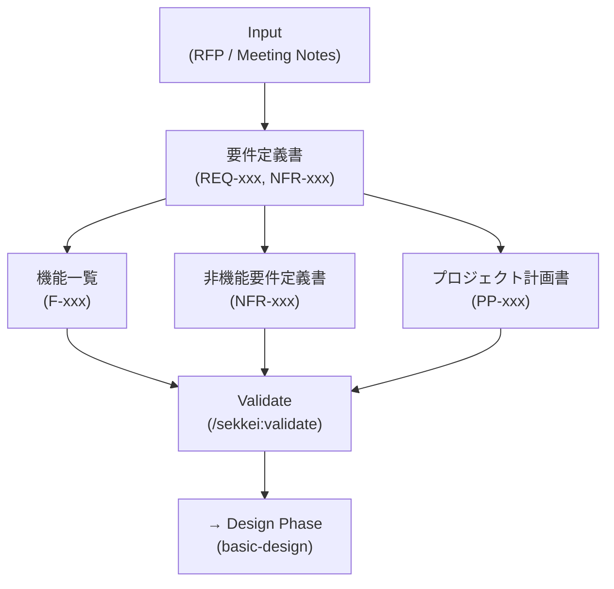

# Requirements Phase — 4 Tài Liệu Yêu Cầu

Xem thêm: [Workflow Index](./index.md) | [V-Model & Tài liệu](../02-v-model-and-documents.md) | [Quick Start](../03-quick-start.md)

---

## Tổng quan

Phase Requirements là nền móng của toàn bộ chain. Bốn tài liệu sinh ra ở đây sẽ được reference bởi tất cả tài liệu downstream — từ 基本設計書 đến 受入テスト仕様書. Nếu Requirements không đầy đủ hoặc ID không nhất quán, các phase sau sẽ có broken cross-references.

**Ai tham gia:**

| Role | RACI | Ghi chú |
|------|------|---------|
| **BA** | Responsible | Người tạo và sở hữu nội dung |
| **PM** | Accountable | Duyệt trước khi gửi khách hàng |
| **Dev Lead** | Consulted | Review tính khả thi kỹ thuật |
| **Khách hàng Nhật** | Informed | Nhận bản review, ký duyệt |

**Entry criteria:** Có ít nhất một trong hai — file RFP từ khách hàng, hoặc meeting notes từ kickoff.

**Exit criteria:** Tất cả 4 tài liệu đã qua `/sekkei:validate` không có lỗi, PM đã duyệt, 要件定義書 đã được ký bởi khách hàng hoặc có email xác nhận scope.

---

## Luồng Requirements Phase



> 機能一覧, 非機能要件定義書, và プロジェクト計画書 có thể chạy song song sau khi 要件定義書 hoàn chỉnh.

---

## Tài liệu 1: 要件定義書 (Tài liệu Đặc tả Yêu cầu)

**Mô tả:** Tài liệu gốc mô tả khách hàng muốn gì — phạm vi hệ thống, yêu cầu chức năng, yêu cầu phi chức năng tổng quan, và tiêu chí nghiệm thu. Đây là tài liệu quan trọng nhất vì mọi tài liệu khác đều phụ thuộc vào nó.

**IDs sinh ra:** `REQ-xxx` (yêu cầu chức năng), `NFR-xxx` (yêu cầu phi chức năng sơ lược)

**Lệnh:**

```
/sekkei:requirements @rfp-notes.md
```

Hoặc mô tả trực tiếp nếu không có file:

```
/sekkei:requirements @[Hệ thống nhân sự SaaS cho doanh nghiệp 100–500 nhân viên.
Tính năng: quản lý hồ sơ nhân viên, chấm công, tính lương, báo cáo HR.
Performance: response < 3s, uptime 99.5%. Compliance: 個人情報保護法.]
```

**Ví dụ output (HR system):**

```
REQ-001  従業員基本情報の登録・更新・削除機能
REQ-002  勤怠管理（出退勤打刻、休暇申請）機能
REQ-003  給与計算・明細発行機能
REQ-004  レポート出力機能（月次・年次）
REQ-005  ロールベースアクセス制御（Admin/Manager/Employee）
NFR-001  画面応答時間: 3秒以内 (95パーセンタイル)
NFR-002  システム稼働率: 99.5%以上
```

> [!TIP]
> Input tiếng Việt hoàn toàn ổn. Sekkei detect `input_lang: "vi"` và sinh output tiếng Nhật chuẩn. Bạn không cần dịch trước khi chạy lệnh.

---

## Tài liệu 2: 機能一覧 (Danh sách Chức năng)

**Mô tả:** Bảng liệt kê toàn bộ chức năng của hệ thống theo cấu trúc 3 tầng: 大分類 (nhóm lớn) → 中分類 (nhóm vừa) → 小機能 (chức năng cụ thể). Đây là tài liệu dùng để estimate, phân công, và track progress.

**IDs sinh ra:** `F-xxx` — theo prefix của 大分類, ví dụ `EMP-001`, `ATT-001`, `SAL-001`

**Lệnh:**

```
/sekkei:functions-list @requirements.md
```

**Ví dụ output (HR system):**

```
大分類: 従業員管理 (Employee Management)
  中分類: 基本情報管理
    F-EMP-001  社員情報登録
    F-EMP-002  社員情報更新
    F-EMP-003  社員情報削除
    F-EMP-004  社員情報検索・一覧表示
  中分類: 組織管理
    F-EMP-010  部署マスタ管理
    F-EMP-011  役職マスタ管理

大分類: 勤怠管理 (Attendance Management)
  中分類: 打刻管理
    F-ATT-001  出勤打刻
    F-ATT-002  退勤打刻
```

> [!TIP]
> Nếu 機能一覧 có từ 3 nhóm 大分類 trở lên, Sekkei sẽ hỏi bạn có muốn bật **split mode** không — sinh file riêng cho từng feature group. Với HR system 6–8 nhóm, nên bật split mode để 基本設計書 không quá dài.

---

## Tài liệu 3: 非機能要件定義書 (Tài liệu Yêu cầu Phi chức năng)

**Mô tả:** Mô tả các ràng buộc kỹ thuật không phải chức năng: hiệu năng, khả dụng, bảo mật, khả năng mở rộng, khả năng bảo trì. **Mọi chỉ số phải là con số cụ thể** — tuyệt đối không viết mơ hồ như "hệ thống phải nhanh" hay "bảo mật cao".

**IDs sinh ra:** `NFR-xxx` — luôn là số nguyên, không dùng chữ (không viết NFR-PERF-001)

**Lệnh:**

```
/sekkei:nfr @requirements.md
```

**Ví dụ output (HR system):**

```
NFR-001  画面表示応答時間: 3秒以内 (95パーセンタイル、同時接続100ユーザー)
NFR-002  システム稼働率: 99.5%以上 (月次計算、計画停止を除く)
NFR-003  同時接続ユーザー数: 最大500ユーザー
NFR-004  データバックアップ: 日次自動バックアップ、72時間以内復旧
NFR-005  パスワードポリシー: 8文字以上、英数字記号混在、90日更新
NFR-006  個人情報保護: 個人情報保護法準拠、暗号化保存 (AES-256)
```

> [!WARNING]
> Sekkei không tự điền con số SLA hay ngân sách — bạn phải cung cấp trong input. Nếu thiếu, Sekkei sẽ đặt placeholder `[要確認]` và báo lỗi khi validate.

---

## Tài liệu 4: プロジェクト計画書 (Kế hoạch Dự án)

**Mô tả:** Tài liệu lập kế hoạch dự án gồm WBS (Work Breakdown Structure), milestones, phân công nhân lực, và timeline. Khách hàng Nhật thường yêu cầu tài liệu này trước khi ký hợp đồng.

**IDs sinh ra:** `PP-xxx`

**Lệnh:**

```
/sekkei:project-plan @requirements.md
```

**Ví dụ output (HR system):**

```
PP-001  要件定義フェーズ: 2024/04/01〜2024/04/14, 担当: BAチーム, 2名
PP-002  基本設計フェーズ: 2024/04/15〜2024/04/30, 担当: Dev Lead, 1名
PP-003  詳細設計・開発フェーズ: 2024/05/01〜2024/07/31, 担当: 開発チーム, 4名
PP-004  テストフェーズ: 2024/08/01〜2024/08/31, 担当: QAチーム, 2名
PP-005  UAT・リリース: 2024/09/01〜2024/09/15, 担当: PM + 顧客
```

---

## Validation & Bước tiếp theo

Sau khi tạo xong cả 4 tài liệu, chạy validate cho từng tài liệu:

```
/sekkei:validate @requirements
/sekkei:validate @functions-list
/sekkei:validate @nfr
/sekkei:validate @project-plan
```

Hoặc validate toàn bộ chain:

```
/sekkei:validate
```

Kiểm tra trạng thái tổng:

```
/sekkei:status
```

Output bạn mong đợi thấy:

```
✓ requirements.md       — REQ-050, NFR-012 — validated
✓ functions-list.md     — F-087 functions — validated
✓ nfr.md                — NFR-012 — validated
✓ project-plan.md       — PP-008 — validated
→ basic-design: READY (all dependencies satisfied)
```

Khi `/sekkei:status` hiện `basic-design: READY`, bạn có thể chuyển sang Design phase.

---

**Phase tiếp theo:** [Design Phase](./02-design.md) — Thiết kế 基本設計書, セキュリティ設計書, 詳細設計書
