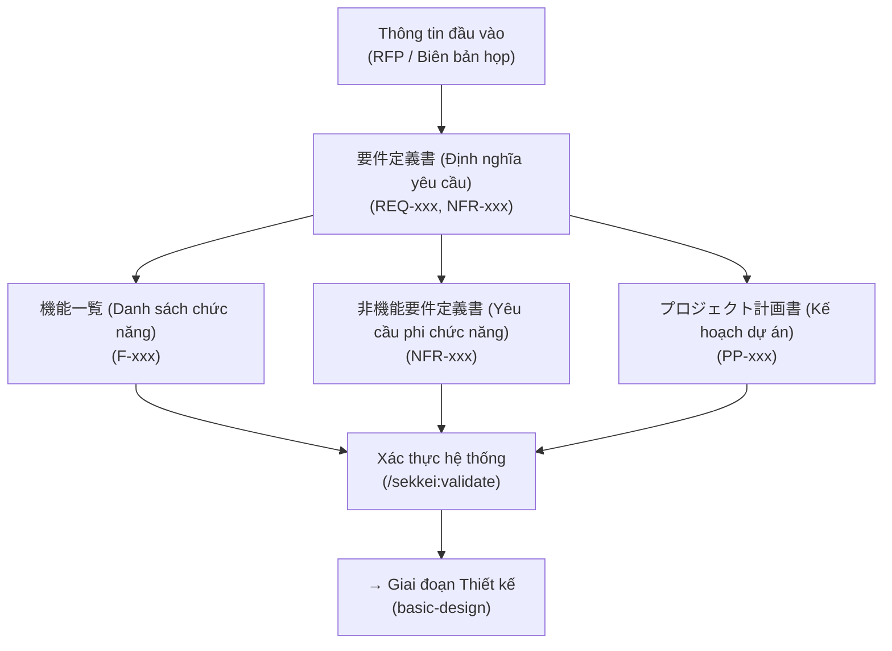

# Giai đoạn Định nghĩa yêu cầu (Requirements) — 4 Loại Hồ sơ Cốt lõi

Xem thêm: [Tổng quan quy trình](./index.md) | [V-Model và Tài liệu](../02-v-model-and-documents.md) | [Bắt đầu nhanh (Quick Start)](../03-quick-start.md)

---

## Tổng quan giai đoạn

Giai đoạn Định nghĩa yêu cầu (Requirements Phase) là nền móng quan trọng nhất cho toàn bộ chuỗi hồ sơ của dự án. Bốn loại tài liệu được khởi tạo tại đây sẽ đóng vai trò là "kim chỉ nam" cho mọi hoạt động ở các giai đoạn sau (downstream) — từ việc xây dựng **基本設計書 (Thiết kế cơ bản)** cho đến việc lập kịch bản **受入テスト仕様書 (Kiểm thử nghiệm thu)**. Một sai sót nhỏ về mã ID hoặc sự thiếu hụt thông tin ở giai đoạn này sẽ gây ra hiệu ứng domino, làm đứt gãy tính nhất quán của toàn bộ hệ thống hồ sơ.

**Các vai trò tham gia:**

| Vai trò | Trách nhiệm (RACI) | Ghi chú |
|------|------|---------|
| **Phân tích nghiệp vụ (BA)** | Thực hiện (Responsible) | Người trực tiếp soạn thảo và quản lý nội dung hồ sơ. |
| **Quản trị dự án (PM)** | Chịu trách nhiệm (Accountable) | Phê duyệt nội dung trước khi bàn giao cho đối tác. |
| **Trưởng nhóm kỹ thuật** | Tham vấn (Consulted) | Đánh giá tính khả thi về mặt công nghệ của các yêu cầu. |
| **Khách hàng Nhật** | Tiếp nhận (Informed) | Rà soát bản thảo và thực hiện ký duyệt chính thức. |

**Điều kiện bắt đầu (Entry criteria):** Đã có hồ sơ mời thầu (RFP) hoặc biên bản cuộc họp khởi động (Kickoff meeting notes).

**Điều kiện hoàn thiện (Exit criteria):** Trọn bộ 4 tài liệu đã vượt qua lệnh kiểm tra `/sekkei:validate` mà không có lỗi, được PM phê duyệt và khách hàng xác nhận phạm vi công việc.

---

## Luồng thực thi giai đoạn Requirements



> Sau khi bản **要件定義書 (Định nghĩa yêu cầu)** hoàn chỉnh, các hồ sơ còn lại (Danh sách chức năng, Phi chức năng, Kế hoạch dự án) có thể được triển khai song song để tối ưu thời gian.

---

## 1. Định nghĩa Yêu cầu — 要件定義書

- **Vai trò:** Là tài liệu gốc ghi lại mọi mong muốn của khách hàng, phạm vi dự án và các tiêu chí để nghiệm thu sản phẩm. Đây là hồ sơ hạt nhân vì mọi tài liệu khác đều được xây dựng dựa trên các mã ID tại đây.
- **Mã định danh:** `REQ-xxx` (yêu cầu chức năng), `NFR-xxx` (yêu cầu phi chức năng sơ lược).
- **Câu lệnh:**
  ```bash
  /sekkei:requirements @rfp-notes.md
  ```

**Ví dụ thực tế (Hệ thống HRM):**
- `REQ-001`: Tính năng đăng ký, cập nhật và xóa hồ sơ nhân viên.
- `REQ-002`: Quản lý chấm công (quẹt thẻ, xin nghỉ phép).
- `NFR-001`: Thời gian phản hồi màn hình dưới 3 giây.

> [!TIP]
> Bạn có thể cung cấp thông tin bằng tiếng Việt. Sekkei sẽ tự động chuyển hóa thành văn phong tiếng Nhật chuyên nghiệp và đúng thuật ngữ chuyên ngành.

---

## 2. Danh sách Chức năng — 機能一覧

- **Vai trò:** Bảng liệt kê chi tiết mọi chức năng hệ thống theo 3 cấp độ: **大分類 (Phân loại lớn)** → **中分類 (Phân loại vừa)** → **小機能 (Tính năng cụ thể)**. Hồ sơ này dùng để quản lý tiến độ và phân công nguồn lực.
- **Mã định danh:** `F-xxx` (thường kèm prefix theo nhóm, ví dụ: `EMP-001`, `ATT-001`).
- **Câu lệnh:**
  ```bash
  /sekkei:functions-list @requirements.md
  ```

**Ví dụ cấu trúc:**
- **大分類 (Phân loại lớn):** Quản lý nhân viên
    - **中分類 (Phân loại vừa):** Thông tin cơ bản
        - `F-EMP-001`: Đăng ký nhân viên mới.

---

## 3. Định nghĩa Yêu cầu Phi chức năng — 非機能要件定義書

- **Vai trò:** Xác lập các quy chuẩn kỹ thuật về hiệu năng, bảo mật, độ ổn định và khả năng bảo trì. Mọi chỉ số tại đây cần được định lượng bằng con số cụ thể để tránh tranh chấp khi nghiệm thu.
- **Mã định danh:** `NFR-xxx`.
- **Câu lệnh:**
  ```bash
  /sekkei:nfr @requirements.md
  ```

**Ví dụ tiêu chuẩn:**
- `NFR-001`: Phản hồi dưới 3 giây khi có 100 người dùng đồng thời.
- `NFR-006`: Tuân thủ nghiêm ngặt **Luật bảo vệ thông tin cá nhân (個人情報保護法)** của Nhật Bản.

---

## 4. Kế hoạch Dự án — プロジェクト計画書

- **Vai trò:** Bản đồ lộ trình bao gồm các mốc quan trọng (Milestones), kế hoạch nhân sự và cấu trúc phân rã công việc (WBS). Khách hàng Nhật thường dùng hồ sơ này để thẩm định năng lực quản trị của đội ngũ.
- **Mã định danh:** `PP-xxx`.
- **Câu lệnh:**
  ```bash
  /sekkei:project-plan @requirements.md
  ```

---

## Xác thực & Chuyển giai đoạn

Sau khi hoàn tất, hãy luôn thực hiện rà soát chất lượng bằng lệnh:
```bash
/sekkei:validate
```
Khi hệ thống hiển thị thông báo `basic-design: READY`, bạn đã đủ điều kiện để chuyển sang giai đoạn kế tiếp.

**Giai đoạn tiếp theo:** [Giai đoạn Thiết kế (Design Phase)](./02-design.md) — Xây dựng các bản Thiết kế cơ bản, Chi tiết và Bảo mật.
 Proudly presented by Antigravity.
