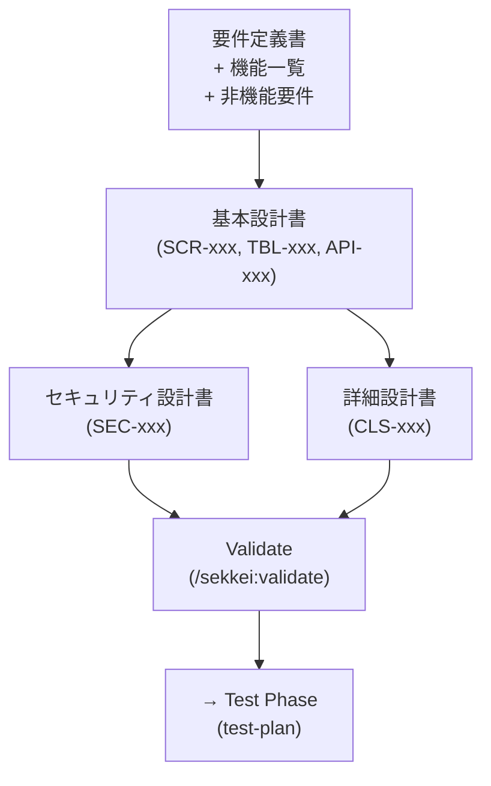

# Design Phase — 3 Tài Liệu Thiết Kế

Xem thêm: [Workflow Index](./index.md) | [Requirements Phase](./01-requirements.md) | [V-Model & Tài liệu](../02-v-model-and-documents.md)

---

## Tổng quan

Design phase biến requirements thành bản thiết kế kỹ thuật mà team dev có thể implement. Ba tài liệu ở phase này là pivot của toàn bộ chain — 基本設計書 là tài liệu trung tâm mà tất cả test specs đều phụ thuộc vào.

**Entry criteria:**
- `requirements.md` đã validate ✓
- `functions-list.md` đã validate ✓
- `nfr.md` đã validate ✓ (cần cho 基本設計書 và セキュリティ設計書)

**Ai tham gia:**

| Role | RACI | Ghi chú |
|------|------|---------|
| **Dev Lead** | Responsible | Người tạo và sở hữu toàn bộ design |
| **PM** | Accountable | Duyệt trước khi gửi khách hàng |
| **BA** | Consulted | Clarify nghiệp vụ khi cần |
| **Khách hàng Nhật** | Informed | Review 基本設計書, ký duyệt |

**Exit criteria:** Cả 3 tài liệu validate sạch, Dev Lead đã review, 基本設計書 được khách hàng ký duyệt.

---

## Luồng Design Phase



> セキュリティ設計書 và 詳細設計書 có thể chạy song song sau khi 基本設計書 hoàn chỉnh.

---

## Tài liệu 5: 基本設計書 (Tài liệu Thiết kế Cơ bản)

**Mô tả:** Tài liệu thiết kế mức cao — kiến trúc hệ thống, danh sách màn hình, định nghĩa database, danh sách API, và luồng nghiệp vụ chính. Đây là tài liệu pivot: 詳細設計書, テスト計画書, IT-spec, ST-spec đều phụ thuộc vào nó.

**IDs sinh ra:** `SCR-xxx` (màn hình), `TBL-xxx` (bảng DB), `API-xxx` (API endpoint)

**Lệnh:**

```
/sekkei:basic-design @requirements.md @functions-list.md
```

**Ví dụ output (HR system):**

```
SCR-001  ログイン画面
SCR-002  ダッシュボード
SCR-003  従業員一覧画面
SCR-004  従業員詳細・編集画面
TBL-001  employees (社員マスタ)
TBL-002  departments (部署マスタ)
TBL-003  attendance_records (勤怠記録)
API-001  GET  /api/employees/{id}
API-002  POST /api/employees
API-003  PUT  /api/employees/{id}
API-004  POST /api/attendance/checkin
```

### Split mode

Với dự án có 3 nhóm 大分類 trở lên trong 機能一覧, nên bật split mode để tránh một file monolithic quá dài:

```yaml
# sekkei.config.yaml
split:
  basic-design: true
  detail-design: true   # optional
```

Khi split mode bật, Sekkei sinh file riêng cho từng feature group:

```
sekkei-docs/
├── basic-design/
│   ├── employee-management.md     # SCR-001~010, TBL-001~003
│   ├── attendance-management.md   # SCR-011~020, TBL-004~005
│   ├── salary-management.md       # SCR-021~030, TBL-006~008
│   └── screen-design/             # 画面設計書 (auto-generated)
│       ├── scr-001-login.md
│       └── ...
```

> [!NOTE]
> Split mode cũng tự động sinh **画面設計書** cho từng màn hình — chi tiết layout, validation rules, event handlers, screen transitions. Xem thêm: [Tài liệu bổ sung](./04-supplementary.md).

### Plan/Implement flow

Với dự án lớn (> 15 tính năng), nên dùng plan/implement flow thay vì generate trực tiếp:

```
# Bước 1: Sekkei tạo implementation plan, chờ bạn review
/sekkei:plan @basic-design

# Sekkei output plan dạng:
# Phase 1: Screen architecture (SCR-001~010)
# Phase 2: Database schema (TBL-001~008)
# Phase 3: API contracts (API-001~020)
# Phase 4: Business flow diagrams
# Proceed? [Y/n/edit]

# Bước 2: Sau khi bạn confirm plan, Sekkei implement
/sekkei:implement
```

Plan/implement flow cho bạn cơ hội điều chỉnh cấu trúc trước khi Sekkei viết toàn bộ nội dung — tiết kiệm thời gian sửa đổi lớn sau này.

---

## Tài liệu 6: セキュリティ設計書 (Tài liệu Thiết kế Bảo mật)

**Mô tả:** Mô tả cách bảo vệ hệ thống theo OWASP Top 10 — authentication, authorization, mã hóa dữ liệu, audit logging, và compliance. Bắt buộc với hệ thống xử lý dữ liệu cá nhân (個人情報) theo luật Nhật.

**IDs sinh ra:** `SEC-xxx`

**Lệnh:**

```
/sekkei:security-design @basic-design.md
```

Sekkei tự động tham chiếu NFR-xxx liên quan đến bảo mật từ `nfr.md` khi sinh tài liệu này.

**Ví dụ output (HR system):**

```
SEC-001  認証方式: OAuth 2.0 + JWT (RS256, アクセストークン有効期限: 1時間)
SEC-002  パスワードハッシュ: bcrypt (cost=12) または Argon2id
SEC-003  通信暗号化: TLS 1.3以上 (TLS 1.2は廃止)
SEC-004  個人情報暗号化: AES-256-GCM (社員番号・マイナンバー・給与情報)
SEC-005  監査ログ: 全CRUD操作を記録、90日間保存
SEC-006  SQLインジェクション対策: プリペアドステートメント必須
SEC-007  XSS対策: CSP ヘッダー設定、入力値サニタイズ
```

> [!TIP]
> Nếu hệ thống xử lý **マイナンバー** (số định danh cá nhân Nhật), Sekkei sẽ tự động thêm section tuân thủ **マイナンバー法** với các yêu cầu bảo mật bổ sung.

---

## Tài liệu 7: 詳細設計書 (Tài liệu Thiết kế Chi tiết)

**Mô tả:** Tài liệu thiết kế mức thấp dành cho developer — class diagram, sequence diagram, xử lý logic từng module, validation rules, error codes. Developer đọc là có thể code được.

**IDs sinh ra:** `CLS-xxx` (class/service)

**Lệnh:**

```
/sekkei:detail-design @basic-design.md
```

**Ví dụ output (HR system):**

```
CLS-001  EmployeeService
         + findById(id: string): Employee
         + findAll(filter: EmployeeFilter): Employee[]
         + create(dto: CreateEmployeeDto): Employee
         + update(id: string, dto: UpdateEmployeeDto): void
         + delete(id: string): void

CLS-002  AttendanceService
         + checkIn(employeeId: string, timestamp: Date): AttendanceRecord
         + checkOut(employeeId: string, timestamp: Date): AttendanceRecord
         + getMonthlyReport(employeeId: string, month: string): MonthlyReport
```

Kèm theo sequence diagram cho các luồng nghiệp vụ chính (VD: luồng cập nhật nhân viên, luồng tính lương tháng), validation rules cho từng field, và error code catalog.

### Khuyến nghị plan/implement

Với dự án có > 20 tính năng, **nên dùng plan/implement flow** để tránh Sekkei sinh quá nhiều class cùng lúc mà bạn không kịp review:

```
/sekkei:plan @detail-design
/sekkei:implement
```

Plan sẽ chia nhỏ theo feature group — bạn có thể approve từng phần hoặc điều chỉnh scope trước khi implement.

---

## Validation & Bước tiếp theo

```
/sekkei:validate @basic-design
/sekkei:validate @security-design
/sekkei:validate @detail-design
```

Kiểm tra cross-reference: mọi `API-xxx` trong 基本設計書 phải có ít nhất một `CLS-xxx` tương ứng trong 詳細設計書. Nếu bị orphaned, validate sẽ báo lỗi.

```
/sekkei:status
```

Output mong đợi:

```
✓ basic-design.md      — SCR-018, TBL-012, API-024 — validated
✓ security-design.md   — SEC-015 — validated
✓ detail-design.md     — CLS-022 — validated
→ test-plan: READY (all dependencies satisfied)
→ ut-spec: waiting for detail-design ✓ (satisfied)
```

---

**Phase tiếp theo:** [Testing Phase](./03-testing.md) — Tạo テスト計画書 và 4 test specs

**Phase trước:** [Requirements Phase](./01-requirements.md)
