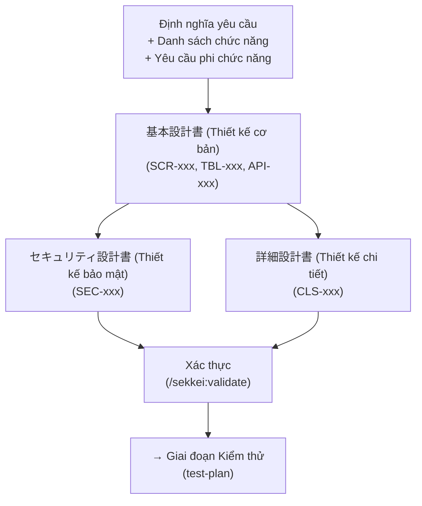

# Giai đoạn Design — 3 Tài liệu Thiết kế Kỹ thuật

Xem thêm: [Tổng quan quy trình](./index.md) | [Giai đoạn Requirements](./01-requirements.md) | [V-Model và Tài liệu](../02-v-model-and-documents.md)

---

## Tổng quan giai đoạn

Giai đoạn thiết kế (Design Phase) có nhiệm vụ chuyển hóa các yêu cầu nghiệp vụ thành những bản thiết kế kỹ thuật chi tiết để đội ngũ phát triển có thể triển khai thực tế. Ba tài liệu trong giai đoạn này đóng vai trò là "trục xoay" của toàn bộ chuỗi tài liệu — trong đó, 基本設計書 (Thiết kế cơ bản) là tài liệu trung tâm mà tất cả các đặc tả kiểm thử sau này đều phải dựa vào.

**Điều kiện bắt đầu (Entry criteria):**
- Tài liệu `requirements.md` đã được xác thực ✓
- Tài liệu `functions-list.md` đã được xác thực ✓
- Tài liệu `nfr.md` đã được xác thực ✓ (thông tin cần thiết cho thiết kế cơ bản và bảo mật)

**Các vai trò tham gia:**

| Vai trò | Trách nhiệm (RACI) | Ghi chú |
|------|------|---------|
| **Dev Lead** | Chịu trách nhiệm thực hiện (Responsible) | Người trực tiếp khởi tạo và chịu trách nhiệm cho toàn bộ nội dung thiết kế. |
| **PM** | Chịu trách nhiệm giải trình (Accountable) | Phê duyệt bản thiết kế trước khi gửi đối tác Nhật. |
| **BA** | Tham vấn (Consulted) | Hỗ trợ làm rõ các yêu cầu nghiệp vụ khi cần thiết. |
| **Khách hàng Nhật** | Nhận thông tin (Informed) | Tiếp nhận, xem xét và ký duyệt bản Thiết kế cơ bản. |

**Điều kiện hoàn thiện (Exit criteria):** Cả 3 tài liệu vượt qua bước xác thực, được Dev Lead phê duyệt nội dung và khách hàng Nhật ký duyệt bản Thiết kế cơ bản.

---

## Luồng công việc giai đoạn Design



> Sau khi hoàn thiện Thiết kế cơ bản (基本設計書), tài liệu Thiết kế bảo mật và Thiết kế chi tiết có thể được thực hiện đồng thời.

---

## 5. Tài liệu Thiết kế Cơ bản — 基本設計書

**Định nghĩa:** Tài liệu thiết kế mức cao mô tả kiến trúc hệ thống, danh sách màn hình, định nghĩa cơ sở dữ liệu, danh sách API và các luồng nghiệp vụ cốt lõi. Đây là tài liệu hạt nhân (pivot): chi tiết thiết kế, kế hoạch kiểm thử và các đặc tả kiểm thử (IT/ST) đều phụ thuộc trực tiếp vào nó.

**Mã ID được sinh ra:** `SCR-xxx` (Màn hình), `TBL-xxx` (Bảng DB), `API-xxx` (API endpoint).

**Câu lệnh thực hiện:**

```
/sekkei:basic-design @requirements.md @functions-list.md
```

**Ví dụ kết quả (Hệ thống nhân sự):**

- `SCR-001`  ログイン画面 (Màn hình đăng nhập)
- `SCR-002`  ダッシュボード (Bảng điều khiển - Dashboard)
- `SCR-003`  従業員一覧画面 (Màn hình danh sách nhân viên)
- `TBL-001`  employees (社員マスタ - Danh mục nhân viên)
- `API-001`  GET  /api/employees/{id}

### Chế độ tách file (Split mode)

Với các dự án có quy mô từ 15 chức năng trở lên, khuyến khích sử dụng chế độ tách file để tránh tạo ra một tài liệu duy nhất quá dài và khó kiểm duyệt:

```yaml
# Cấu hình trong file sekkei.config.yaml
split:
  basic-design: true
  detail-design: true
```

Khi kích hoạt chế độ này, Sekkei sẽ tự động phân tách tài liệu theo từng nhóm tính năng (ví dụ: quản lý nhân viên, chấm công, tính lương).

> [!NOTE]
> Chế độ tách file cũng sẽ tự động khởi tạo **画面設計書 (Tài liệu thiết kế màn hình)** cho từng màn hình cụ thể — bao gồm chi tiết layout, quy tắc xác thực, xử lý sự kiện và luồng chuyển đổi màn hình.

---

## 6. Tài liệu Thiết kế Bảo mật — セキュリティ設計書

**Định nghĩa:** Mô tả chi tiết phương án bảo vệ hệ thống theo tiêu chuẩn OWASP Top 10, bao gồm: xác thực, phân quyền, mã hóa dữ liệu và tuân thủ pháp lý. Bước này là bắt buộc đối với các hệ thống xử lý thông tin cá nhân (個人情報) của khách hàng Nhật.

**Mã ID được sinh ra:** `SEC-xxx`.

**Câu lệnh thực hiện:**

```
/sekkei:security-design @basic-design.md
```

Sekkei sẽ tự động trích xuất các yêu cầu phi chức năng (NFR-xxx) liên quan đến bảo mật từ tài liệu `nfr.md` để đưa vào bản thiết kế này.

**Ví dụ nội dung bảo mật:**

- `SEC-001` Xác thực: OAuth 2.0 + JWT.
- `SEC-004` Mã hóa thông tin cá nhân: AES-256-GCM áp dụng cho 社員番号 (Mã nhân viên) và マイナンバー (Số định danh cá nhân).

> [!TIP]
> Nếu hệ thống có xử lý số **My Number (マイナンバー)**, Sekkei sẽ tự động thêm phần nội dung tuân thủ **マイナンバー法 (Luật My Number)** với các tiêu chuẩn bảo mật khắt khe hơn.

---

## 7. Tài liệu Thiết kế Chi tiết — 詳細設計書

**Định nghĩa:** Tài liệu thiết kế mức thấp phục vụ trực tiếp cho lập trình viên, bao gồm: sơ đồ lớp, sơ đồ tuần tự, logic xử lý chi tiết từng module, quy tắc xác thực và bảng danh mục mã lỗi.

**Mã ID được sinh ra:** `CLS-xxx` (Lớp xử lý/Dịch vụ).

**Câu lệnh thực hiện:**

```
/sekkei:detail-design @basic-design.md
```

**Ví dụ thiết kế lớp (Hệ thống nhân sự):**

- `CLS-001`  EmployeeService: Xử lý các phép toán CRUD cho nhân viên.
- `CLS-002`  AttendanceService: Xử lý logic quẹt thẻ vào/ra và báo cáo tháng.

---

## 8. Tạo Mockup màn hình — `/sekkei:mockup`

Sau khi hoàn thành Thiết kế cơ bản (hoặc Thiết kế màn hình riêng), bạn có thể tạo **mockup HTML tương tác** trực tiếp từ các định nghĩa màn hình trong tài liệu.

**Câu lệnh thực hiện:**

```
/sekkei:mockup                    # Tạo HTML + chụp ảnh + nhúng PNG vào tài liệu
/sekkei:mockup --screenshot       # Chỉ chụp lại ảnh từ HTML đã có (sau khi chỉnh sửa thủ công)
```

**Quy trình hoạt động:**

1. Đọc định nghĩa màn hình từ `screen-design.md` (split mode) hoặc `basic-design.md` (monolithic mode)
2. Đọc `functions-list.md` để tạo menu sidebar điều hướng
3. Tạo file HTML cho mỗi màn hình sử dụng template admin-shell (header, sidebar, content area)
4. Đánh số annotation (1, 2, 3...) cho các phần tử tương tác — mapping với bảng 画面項目定義
5. Chụp ảnh mỗi HTML bằng Playwright (1440x900, retina 2x)
6. Nhúng PNG screenshot vào tài liệu thiết kế tương ứng

**Kết quả:**
- HTML files: `{output.directory}/11-mockups/{function-id}-{screen-name}.html`
- Screenshots: `features/{id}/assets/images/` (split) hoặc `03-system/assets/images/` (monolithic)

**Quy trình sử dụng điển hình:**

```
/sekkei:basic-design @requirements.md    # Tạo thiết kế cơ bản (bao gồm danh sách màn hình)
/sekkei:mockup                           # Tạo HTML mockup + screenshot
(chỉnh sửa HTML thủ công nếu cần)
/sekkei:mockup --screenshot              # Chụp lại ảnh sau khi chỉnh sửa
```

> [!TIP]
> CSS framework (`admin-shell.css`) cung cấp sẵn các component: form, table, dashboard grid, wizard stepper, stat cards. Bạn có thể chỉnh sửa HTML trực tiếp rồi chạy `--screenshot` để cập nhật ảnh mà không cần tạo lại HTML.

> [!TIP]
> Nếu dự án đã có mã nguồn (source code), bạn có thể cung cấp đường dẫn để Sekkei tự động phân tích cấu trúc lớp, API endpoints và entity — giúp tạo ra thiết kế chi tiết chính xác hơn:
> ```
> /sekkei:detail-design @basic-design.md --source-path=./src
> ```

## Lưu ý thường gặp

- Đảm bảo mọi `SCR-xxx` trong Thiết kế cơ bản đều có `CLS-xxx` tương ứng trong Thiết kế chi tiết.
- Nếu sử dụng chế độ tách file (split mode), kiểm tra rằng tham chiếu chéo giữa các file con vẫn nhất quán.
- Thông tin bảo mật nhạy cảm (mật khẩu, khóa API) không được xuất hiện trực tiếp trong tài liệu thiết kế.

---

## Xác thực & Hoàn tất giai đoạn

```bash
/sekkei:validate @basic-design
/sekkei:validate @security-design
/sekkei:validate @detail-design
```

Hệ thống sẽ thực hiện kiểm tra tham chiếu chéo: đảm bảo mọi API định nghĩa trong Thiết kế cơ bản đều có lớp xử lý tương ứng trong Thiết kế chi tiết.

Sử dụng lệnh `/sekkei:status` để kiểm tra tiến độ. Khi hệ thống báo `test-plan: READY`, bạn có thể chính thức bước sang giai đoạn Kiểm thử.

---

**Giai đoạn tiếp theo:** [Giai đoạn Kiểm thử (Testing Phase)](./03-testing.md) — Khởi tạo テスト計画書 và 4 tài liệu đặc tả kiểm thử cụ thể.

**Giai đoạn trước đó:** [Giai đoạn Requirements](./01-requirements.md)
