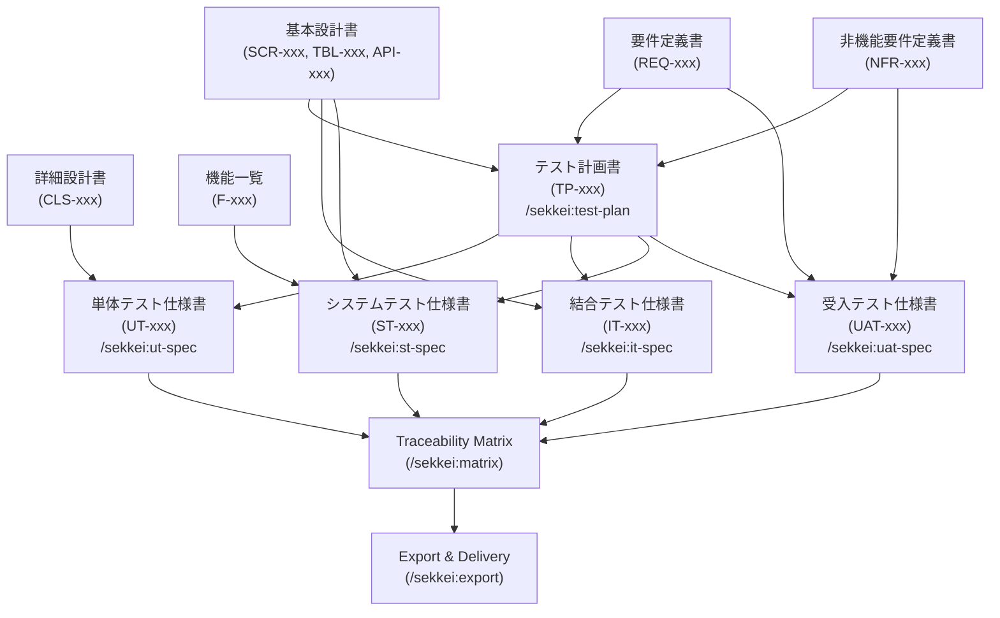

# Testing Phase — 5 Tài Liệu Kiểm Thử

Xem thêm: [Workflow Index](./index.md) | [Design Phase](./02-design.md) | [V-Model & Tài liệu](../02-v-model-and-documents.md)

---

## Tổng quan

Test phase sinh 5 tài liệu — một kế hoạch tổng thể và bốn bộ test specs cho từng cấp kiểm thử theo V-model. テスト計画書 là "master plan" mà bốn specs còn lại đều phải tuân theo về phạm vi, môi trường, và exit criteria.

**Entry criteria:**

| Tài liệu | Cần cho |
|---------|---------|
| `requirements.md` ✓ | テスト計画書, 受入テスト仕様書 |
| `nfr.md` ✓ | テスト計画書, 受入テスト仕様書 |
| `basic-design.md` ✓ | テスト計画書, 結合テスト仕様書, システムテスト仕様書 |
| `functions-list.md` ✓ | システムテスト仕様書 |
| `detail-design.md` ✓ | 単体テスト仕様書 |

**Ai tham gia:**

| Role | RACI | Ghi chú |
|------|------|---------|
| **QA Lead** | Responsible | Tạo テスト計画書, ST-spec, UAT-spec |
| **Developer** | Responsible | Tạo UT-spec |
| **QA / Dev** | Responsible | Tạo IT-spec |
| **PM** | Accountable | Duyệt テスト計画書 |
| **Dev Lead** | Consulted | Review IT-spec, UT-spec |
| **Khách hàng Nhật** | Informed | Chạy UAT, ký nghiệm thu |

**Exit criteria:** Tất cả 5 tài liệu validate sạch, traceability matrix (`/sekkei:matrix`) không có gap, PM đã duyệt テスト計画書.

---

## Luồng Testing Phase



> UT-spec, IT-spec, ST-spec, UAT-spec có thể chạy song song sau khi テスト計画書 hoàn chỉnh.

---

## Tài liệu 8: テスト計画書 (Kế hoạch Kiểm thử)

**Mô tả:** Tài liệu chiến lược test tổng thể — xác định phạm vi test, môi trường, công cụ, entry/exit criteria cho cả 4 cấp (UT, IT, ST, UAT). Là "master plan" mà các test spec phải tuân theo.

**IDs sinh ra:** `TP-xxx`

**Lệnh:**

```
/sekkei:test-plan @requirements.md @nfr.md @basic-design.md
```

**Ví dụ output (HR system):**

```
TP-001  単体テスト Exit Criteria: カバレッジ80%以上、全テストケース合格
TP-002  結合テスト 実施環境: ステージング環境 (本番同等構成)
TP-003  システムテスト 性能テスト目標: NFR-001準拠 (応答3秒以内)
TP-004  受入テスト スケジュール: 2024/09/01〜09/10、顧客立会い実施
TP-005  テストツール: Jest (UT)、Postman (IT)、JMeter (性能)
```

> [!TIP]
> テスト計画書 có thể bắt đầu song song với 基本設計書 — không cần 詳細設計書 hoàn chỉnh. Đây là cách tối ưu thời gian cho dự án có timeline chặt.

---

## Tài liệu 9: 単体テスト仕様書 (Đặc tả Kiểm thử Đơn vị)

**Mô tả:** Test cases cho từng class/function — phân loại theo 3 loại bắt buộc: **正常系** (happy path), **異常系** (error cases), **境界値** (boundary values). Mỗi module cần tối thiểu 5 test cases.

**IDs sinh ra:** `UT-xxx`

**Lệnh:**

```
/sekkei:ut-spec @detail-design.md @test-plan.md
```

**Ví dụ output (HR system):**

```
UT-001  EmployeeService.findById() 正常系
        入力: 存在するID "EMP-001"
        期待結果: 社員オブジェクト返却 (id, name, department, salary)

UT-002  EmployeeService.findById() 異常系
        入力: 存在しないID "EMP-999"
        期待結果: NotFoundException (HTTP 404)

UT-003  EmployeeService.findById() 境界値
        入力: 空文字 ""
        期待結果: BadRequestException (HTTP 400)

UT-004  SalaryCalculator.calculate() 正常系
        入力: 基本給 300,000円、残業30時間
        期待結果: 総支給額 = 300,000 + (300,000/160 × 1.25 × 30)

UT-005  SalaryCalculator.calculate() 境界値
        入力: 残業時間 0時間
        期待結果: 残業代 0円 (基本給のみ返却)
```

**Quy tắc phân loại test cases:**

| Loại | Tiếng Việt | Mô tả |
|------|-----------|-------|
| 正常系 | Happy path | Input hợp lệ, xử lý thành công |
| 異常系 | Error case | Input không hợp lệ hoặc điều kiện lỗi |
| 境界値 | Boundary value | Giá trị biên: 0, null, max, min, empty |

> [!WARNING]
> Sekkei sinh tối thiểu 5 cases/module theo TP-001. Nếu module phức tạp (nhiều business logic), bạn nên thêm cases thủ công sau khi Sekkei sinh draft.

---

## Tài liệu 10: 結合テスト仕様書 (Đặc tả Kiểm thử Tích hợp)

**Mô tả:** Test cases kiểm tra giao tiếp giữa các module — API contracts, request/response schemas, error codes, tích hợp với external services. Focus vào interface, không phải nội bộ từng class.

**IDs sinh ra:** `IT-xxx`

**Lệnh:**

```
/sekkei:it-spec @basic-design.md @test-plan.md
```

**Ví dụ output (HR system):**

```
IT-001  API-001 GET /api/employees/{id}
        正常系: 200 OK + 社員オブジェクト (id, name, email, department)
        レスポンス時間: 500ms以内

IT-002  API-001 GET /api/employees/{id}
        異常系: IDが文字列 → 400 Bad Request
        レスポンスボディ: { "error": "INVALID_ID_FORMAT" }

IT-003  API-002 POST /api/employees
        正常系: 必須フィールド全入力 → 201 Created + 新規社員ID返却

IT-004  API-002 POST /api/employees
        異常系: メールアドレス重複 → 409 Conflict
        レスポンスボディ: { "error": "EMAIL_ALREADY_EXISTS" }

IT-005  勤怠API連携: POST /api/attendance/checkin → 給与計算APIへのデータ連携確認
```

---

## Tài liệu 11: システムテスト仕様書 (Đặc tả Kiểm thử Hệ thống)

**Mô tả:** Test cases end-to-end kiểm tra toàn bộ hệ thống như một khối — business scenarios, performance tests (với targets số cụ thể từ NFR), và security tests. Không split theo feature.

**IDs sinh ra:** `ST-xxx`

**Lệnh:**

```
/sekkei:st-spec @basic-design.md @functions-list.md @test-plan.md
```

**Ví dụ output (HR system):**

```
ST-001  E2Eシナリオ: 新入社員登録→承認→給与計算フロー
        手順: ①人事担当者が社員情報登録 ②管理者が承認 ③給与システムに自動連携
        期待結果: 全ステップ正常完了、DB整合性確認

ST-020  性能テスト: 同時接続100ユーザー
        条件: JMeter、ランプアップ60秒、実行5分
        期待結果: 応答時間3秒以内 (NFR-001)、エラー率0%

ST-021  性能テスト: 同時接続500ユーザー (最大負荷)
        期待結果: 応答時間5秒以内、エラー率1%以下

ST-030  セキュリティテスト: 権限外データアクセス
        条件: Employeeロールで他社員の給与情報へアクセス試行
        期待結果: 403 Forbidden、監査ログに記録 (SEC-005)
```

> [!NOTE]
> Performance test targets trong ST-spec được tự động lấy từ NFR-xxx. Nếu NFR không có con số cụ thể, Sekkei sẽ đặt placeholder và báo lỗi khi validate.

---

## Tài liệu 12: 受入テスト仕様書 (Đặc tả Kiểm thử Nghiệm thu)

**Mô tả:** Test cases từ góc nhìn khách hàng/business — không phải technical, mà là "hệ thống có đáp ứng nhu cầu nghiệp vụ không?". Khách hàng Nhật thường tự chạy UAT và ký nghiệm thu dựa trên tài liệu này. Ngôn ngữ phải dùng từ nghiệp vụ, không dùng thuật ngữ kỹ thuật.

**IDs sinh ra:** `UAT-xxx`, mỗi UAT case phải map đến ít nhất một `REQ-xxx`

**Lệnh:**

```
/sekkei:uat-spec @requirements.md @nfr.md @test-plan.md
```

**Ví dụ output (HR system):**

```
UAT-001  人事担当者として、新入社員の情報（氏名・所属・入社日）を
         登録できること。(REQ-001)
         確認方法: 登録後に一覧画面で当該社員が表示される

UAT-002  管理者として、部下の休暇申請を承認・却下できること。(REQ-002)
         確認方法: 承認後に社員側で「承認済み」ステータスが表示される

UAT-003  人事担当者として、月次給与計算を実行し、
         給与明細をPDFで出力できること。(REQ-003)
         確認方法: PDF内の計算式が給与規程と一致する

UAT-010  システム稼働率として、平日9:00〜18:00の業務時間内に
         サービスが利用可能であること。(NFR-002)
```

**Nguyên tắc viết UAT cases:**

- Dùng persona: *「〜として」* (với tư cách là...)
- Mô tả hành động nghiệp vụ, không mô tả thao tác UI kỹ thuật
- Mỗi case phải có **確認方法** (cách xác nhận kết quả)
- Map rõ ràng đến `REQ-xxx` hoặc `NFR-xxx`

> [!TIP]
> UAT-spec được viết để khách hàng Nhật có thể tự chạy mà không cần giải thích thêm. Sekkei dùng keigo level từ `sekkei.config.yaml` — với UAT nên dùng `丁寧語` hoặc `謙譲語` để tạo ấn tượng chuyên nghiệp.

---

## Traceability Matrix

Sau khi tạo xong tất cả test specs, sinh traceability matrix để kiểm tra coverage:

```
/sekkei:matrix
```

Matrix hiện quan hệ: REQ-xxx ↔ F-xxx ↔ SCR-xxx ↔ UT-xxx ↔ IT-xxx ↔ ST-xxx ↔ UAT-xxx

Output mẫu cho thấy coverage gaps:

```
⚠ REQ-007 (ロック解除機能) không có UAT case nào map đến
⚠ F-ATT-005 (有給残日数表示) không có ST case nào
✓ 87% REQ-xxx đã có UAT coverage
```

Với mỗi gap, thêm test case thủ công hoặc chạy lại spec tương ứng với input bổ sung.

---

## Validation & Export

```
/sekkei:validate @test-plan
/sekkei:validate @ut-spec
/sekkei:validate @it-spec
/sekkei:validate @st-spec
/sekkei:validate @uat-spec
```

Khi tất cả validate sạch, export toàn bộ bộ tài liệu:

```
# Export từng tài liệu
/sekkei:export @uat-spec --format=xlsx
/sekkei:export @st-spec --format=xlsx

# Hoặc export toàn bộ chain
/sekkei:export --all --format=xlsx
```

```
/sekkei:status
```

Output mong đợi khi hoàn thành:

```
✓ test-plan.md    — TP-008 — validated
✓ ut-spec.md      — UT-156 cases — validated
✓ it-spec.md      — IT-048 cases — validated
✓ st-spec.md      — ST-062 cases — validated
✓ uat-spec.md     — UAT-038 cases — validated
✓ Traceability: 94% REQ coverage
→ Chain COMPLETE — ready for export
```

---

**Phase trước:** [Design Phase](./02-design.md)

**Tài liệu bổ sung:** [Supplementary Docs](./04-supplementary.md) — CRUD図, export, translation

**Thay đổi sau khi spec freeze:** [Change Request](./05-change-request.md)
