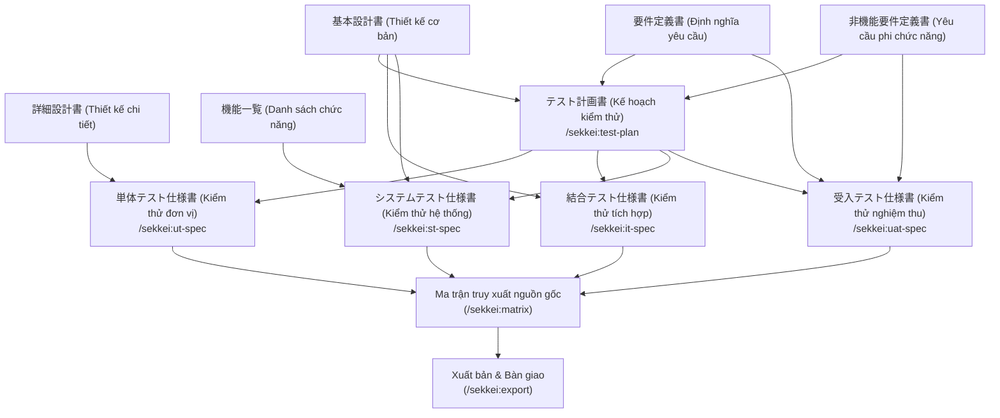

# Giai đoạn Testing — 7 Tài liệu Kiểm thử cốt lõi

Xem thêm: [Tổng quan quy trình](./index.md) | [Giai đoạn Design](./02-design.md) | [V-Model và Tài liệu](../02-v-model-and-documents.md)

---

## Tổng quan giai đoạn

Giai đoạn Kiểm thử (Testing Phase) sẽ khởi tạo 7 tài liệu quan trọng — bao gồm kế hoạch tổng thể, bốn bộ đặc tả kiểm thử tương ứng với từng cấp độ trong V-Model, テスト結果報告書 (Báo cáo kết quả kiểm thử) và テストエビデンス (Bằng chứng kiểm thử). Trong đó, テスト計画書 (Kế hoạch kiểm thử) đóng vai trò là "bản quy hoạch tổng thể" mà các đặc tả kiểm thử còn lại phải tuân thủ nghiêm ngặt về phạm vi, môi trường và các điều kiện hoàn thành.

**Điều kiện bắt đầu (Entry criteria):**

| Tài liệu cần thiết | Mục đích sử dụng |
|---------|---------|
| `requirements.md` ✓ | Kế hoạch kiểm thử, Kiểm thử nghiệm thu |
| `nfr.md` ✓ | Kế hoạch kiểm thử, Kiểm thử nghiệm thu |
| `basic-design.md` ✓ | Kế hoạch kiểm thử, Kiểm thử tích hợp, Kiểm thử hệ thống |
| `functions-list.md` ✓ | Kiểm thử hệ thống |
| `detail-design.md` ✓ | Kiểm thử đơn vị |

**Các vai trò tham gia:**

| Vai trò | Trách nhiệm (RACI) | Ghi chú |
|------|------|---------|
| **QA Lead** | Chịu trách nhiệm thực hiện (Responsible) | Khởi tạo Kế hoạch kiểm thử, Đặc tả ST và Đặc tả UAT. |
| **Developer** | Chịu trách nhiệm thực hiện (Responsible) | Khởi tạo Đặc tả kiểm thử đơn vị (UT). |
| **QA / Dev** | Chịu trách nhiệm thực hiện (Responsible) | Khởi tạo Đặc tả kiểm thử tích hợp (IT). |
| **PM** | Chịu trách nhiệm giải trình (Accountable) | Phê duyệt Kế hoạch kiểm thử tổng thể. |
| **Khách hàng Nhật** | Nhận thông tin (Informed) | Trực tiếp tham gia kiểm thử nghiệm thu (UAT) và ký biên bản. |

**Điều kiện hoàn thiện (Exit criteria):**

| Tiêu chí | Mô tả |
|---------|-------|
| Xác thực đạt | Cả 7 tài liệu vượt qua `/sekkei:validate` |
| Ma trận hoàn chỉnh | Traceability Matrix không có lỗ hổng |
| PM phê duyệt | Kế hoạch kiểm thử được PM ký duyệt |
| Khách hàng xác nhận | Phạm vi UAT được khách hàng đồng ý |

---

## Luồng công việc giai đoạn Testing



---

## 8. Kế hoạch Kiểm thử — テスト計画書

**Định nghĩa:** Tài liệu chiến lược kiểm thử tổng thể — xác định phạm vi, môi trường, công cụ, tiêu chí bắt đầu và kết thúc cho cả 4 cấp độ (UT, IT, ST, UAT).

**Mã ID được sinh ra:** `TP-xxx`.

**Câu lệnh thực hiện:**

```
/sekkei:test-plan @requirements.md @nfr.md @basic-design.md
```

**Ví dụ nội dung:**
- `TP-001` Tiêu chí hoàn thành Kiểm thử đơn vị: Độ bao phủ code (Coverage) trên 80%.
- `TP-004` Lộ trình Kiểm thử nghiệm thu: Từ 01/09 đến 10/09 với sự tham gia trực tiếp của khách hàng.

---

## 9. Đặc tả Kiểm thử Đơn vị — 単体テスト仕様書

**Định nghĩa:** Các kịch bản kiểm thử (Test cases) cho từng lớp hoặc hàm — được phân loại theo 3 nhóm bắt buộc: **正常系** (Happy path - Trường hợp thông thường), **異常系** (Error case - Trường hợp bất thường), và **境界値** (Boundary value - Giá trị biên).

**Mã ID được sinh ra:** `UT-xxx`.

**Câu lệnh thực hiện:**

```
/sekkei:ut-spec @detail-design.md @test-plan.md
```

**Phân loại kịch bản kiểm thử:**

| Phân loại | Tên tiếng Việt | Mô tả |
|------|-----------|-------|
| **正常系** | Trường hợp thông thường | Dữ liệu đầu vào hợp lệ, hệ thống xử lý thành công. |
| **異常系** | Trường hợp bất thường | Dữ liệu không hợp lệ hoặc giả lập tình huống lỗi hệ thống. |
| **境界値** | Giá trị biên | Kiểm tra tại các ngưỡng giới hạn (như 0, giá trị tối đa, chuỗi rỗng). |

---

## 10. Đặc tả Kiểm thử Tích hợp — 結合テスト仕様書

**Định nghĩa:** Các kịch bản kiểm thử tập trung vào sự tương tác giữa các module — kiểm tra API, cấu trúc dữ liệu trao đổi, mã lỗi và tích hợp với các hệ thống bên ngoài.

**Mã ID được sinh ra:** `IT-xxx`.

**Câu lệnh thực hiện:**

```
/sekkei:it-spec @basic-design.md @test-plan.md
```

**Ví dụ kịch bản:**
- `IT-001` Kiểm tra API lấy thông tin nhân viên: Trả về mã 200 OK và đúng định dạng dữ liệu.

---

## 11. Đặc tả Kiểm thử Hệ thống — システムテスト仕様書

**Định nghĩa:** Kiểm thử toàn diện hệ thống dưới góc độ quy trình nghiệp vụ xuyên suốt (End-to-End), kiểm tra hiệu năng (dựa trên các chỉ số định lượng từ NFR) và bảo mật.

**Mã ID được sinh ra:** `ST-xxx`.

**Câu lệnh thực hiện:**

```
/sekkei:st-spec @basic-design.md @functions-list.md @test-plan.md
```

---

## 12. Đặc tả Kiểm thử Nghiệm thu — 受入テスト仕様書

**Định nghĩa:** Các kịch bản kiểm thử từ góc nhìn người dùng cuối hoặc chủ dự án. Tài liệu này tập trung vào câu hỏi: "Hệ thống có đáp ứng đúng nhu cầu nghiệp vụ không?". Khách hàng Nhật thường sử dụng tài liệu này để tự thực hiện nghiệm thu. Ngôn ngữ trình bày phải thuần nghiệp vụ, tránh các thuật ngữ kỹ thuật sâu.

**Mã ID được sinh ra:** `UAT-xxx` (mỗi kịch bản phải ánh xạ tới ít nhất một mã yêu cầu REQ-xxx).

**Câu lệnh thực hiện:**

```
/sekkei:uat-spec @requirements.md @nfr.md @test-plan.md
```

**Nguyên tắc trình bày kịch bản UAT:**
- Sử dụng cấu trúc: *「〜として...できること」* (Với tư cách là [vai trò]... có thể thực hiện [hành động]).
- Mô tả rõ **確認方法 (Phương pháp xác nhận)** kết quả thực tế.
- Đảm bảo tính chuyên nghiệp bằng cách sử dụng mức độ kính ngữ (keigo) phù hợp từ cấu hình dự án.

---

## 13. Báo cáo Kết quả Kiểm thử — テスト結果報告書 (MỚI)

**Định nghĩa:** Tổng hợp kết quả thực thi kiểm thử theo từng cấp độ (UT/IT/ST/UAT): tỷ lệ đạt/không đạt, danh sách lỗi phát hiện, đánh giá chất lượng tổng thể và kết luận phát hành.

**Mã ID được sinh ra:** `TR-xxx`.

**Câu lệnh thực hiện:**

```
/sekkei:test-result-report @ut-spec.md @it-spec.md @st-spec.md @uat-spec.md
```

**Nội dung chính:**
- Tổng hợp kết quả theo từng cấp độ kiểm thử
- Danh sách lỗi (defect list) theo mức độ nghiêm trọng
- Đánh giá chất lượng (品質判定) và khuyến nghị phát hành
- Tham chiếu đến テストエビデンス cho bằng chứng cụ thể

---

## 14. Bằng chứng Kiểm thử — テストエビデンス (MỚI)

**Định nghĩa:** Lưu trữ bằng chứng thực tế cho từng test case: ảnh chụp màn hình, kết quả thực thi, tên người thực hiện và ngày thực hiện. Tổ chức theo 4 cấp độ UT/IT/ST/UAT.

**Câu lệnh thực hiện:**

```
/sekkei:test-evidence @test-plan.md
```

---

## Ma trận truy xuất nguồn gốc (Traceability Matrix)

Sau khi hoàn thiện các đặc tả, hãy khởi tạo ma trận truy xuất nguồn gốc để đảm bảo độ bao phủ của việc kiểm thử:

```bash
/sekkei:matrix
```

Ma trận này sẽ hiển thị mối quan hệ chặt chẽ giữa: **Yêu cầu (REQ) ↔ Chức năng (F) ↔ Thiết kế (SCR) ↔ Các cấp độ kiểm thử (UT, IT, ST, UAT)**. Nếu có bất kỳ yêu cầu nào chưa có kịch bản kiểm thử tương ứng, hệ thống sẽ đưa ra cảnh báo để bạn bổ sung kịp thời.

> [!TIP]
> Khi khởi tạo kịch bản kiểm thử, hãy đảm bảo mỗi yêu cầu (REQ-xxx) có ít nhất một kịch bản kiểm thử tương ứng. Sử dụng lệnh `/sekkei:matrix` để kiểm tra độ bao phủ trước khi bàn giao.

---

## Xác thực & Xuất bản

Hãy thực hiện xác thực cho từng tài liệu và khi mọi thứ đã sẵn sàng, bạn có thể xuất bản toàn bộ bộ tài liệu để chuẩn bị bàn giao:

```bash
# Xuất bản từng tài liệu (Ví dụ: Đặc tả nghiệm thu)
/sekkei:export @uat-spec --format=xlsx

# Hoặc xuất bản toàn bộ chuỗi tài liệu của dự án
/sekkei:export --all --format=xlsx
```

Kiểm tra trạng thái cuối cùng bằng lệnh `/sekkei:status`. Một kết quả hoàn hảo sẽ hiển thị thông báo `Chain COMPLETE — ready for export`.

---

**Giai đoạn trước đó:** [Giai đoạn Design](./02-design.md)
