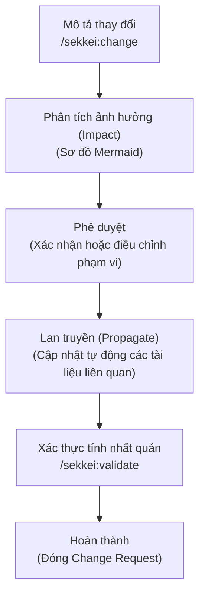

# Quy trình Change Request — Quản lý Thay đổi Đặc tả

Xem thêm: [Tổng quan quy trình](./index.md) | [Giai đoạn Testing](./03-testing.md) | [V-Model và Tài liệu](../02-v-model-and-documents.md)

---

## Tại sao cần quy trình Change Request?

Khi bộ đặc tả đã được khách hàng phê duyệt (giai đoạn chốt phạm vi - spec freeze), bất kỳ một thay đổi nào — dù là nhỏ nhất như thêm một trường thông tin vào màn hình — cũng có thể tạo ra "hiệu ứng dây chuyền" ảnh hưởng đến nhiều tài liệu khác trong chuỗi liên kết.

Ví dụ: Việc bổ sung trường **"部署異動履歴" (Lịch sử thuyên chuyển bộ phận)** vào màn hình chi tiết nhân viên sẽ gây ảnh hưởng đến:
- **SCR-004** (Thiết kế màn hình).
- **TBL-001** (Định nghĩa bảng cơ sở dữ liệu).
- **API-003** (Cấu trúc dữ liệu API).
- **CLS-001** (Logic xử lý trong Thiết kế chi tiết).
- **IT-003** và **ST-001** (Kịch bản kiểm thử tích hợp và hệ thống).

Nếu không được truy vết đầy đủ, bộ tài liệu bàn giao sẽ mất tính nhất quán. Đối tác Nhật Bản với sự kỹ tính đặc trưng sẽ dễ dàng phát hiện ra những sai sót này và yêu cầu thực hiện lại từ đầu.

Quy trình **Change Request (変更要求書 - Yêu cầu thay đổi)** trong Sekkei giúp bạn kiểm soát chặt chẽ luồng thay đổi: **Mô tả → Phân tích ảnh hưởng → Phê duyệt → Lan truyền thay đổi (Propagate) → Xác thực**.

---

## Vòng đời của một Change Request



---

## Khởi tạo Yêu cầu thay đổi

Sử dụng câu lệnh:
```bash
/sekkei:change
```

Sekkei sẽ yêu cầu bạn mô tả nội dung thay đổi. 

**Ví dụ:**
- **Nội dung:** Bổ sung tab "部署異動履歴" (Lịch sử thuyên chuyển bộ phận) vào màn hình chi tiết nhân viên (SCR-004).
- **Mục tiêu:** Hiển thị toàn bộ quá trình luân chuyển bộ phận của nhân viên trong công ty.

Sekkei sẽ tự động phân tích và đưa ra sơ đồ ảnh hưởng (Impact Graph), liệt kê chính xác những mã ID và tài liệu nào cần phải được cập nhật tương ứng.

---

## Các lệnh hỗ trợ quản lý

Nếu bạn cần tạm dừng và tiếp tục sau đó:
```bash
/sekkei:change --resume CR-001
```

Kiểm tra trạng thái hiện tại của yêu cầu thay đổi:
```bash
/sekkei:change --status
```

Xem danh sách toàn bộ các yêu cầu thay đổi trong dự án:
```bash
/sekkei:change --list
```

**Lưu ý về việc Hủy (Cancel) và Hoàn tác (Rollback):**
- Lệnh `--cancel` sẽ dừng quá trình cập nhật và giữ nguyên trạng thái hiện tại của các tài liệu.
- Lệnh `--rollback` chỉ hoạt động hiệu quả nếu bạn chưa thực hiện `git commit` cho các thay đổi đó. Sekkei sử dụng cơ chế của Git để khôi phục trạng thái tài liệu trước khi thực hiện thay đổi.

---

## Quá trình Lan truyền thay đổi (Propagation)

Khi bạn xác nhận thực hiện (`Proceed`), Sekkei sẽ bắt đầu cập nhật từng tài liệu theo đúng thứ tự ưu tiên của chuỗi liên kết. Tại mỗi bước, hệ thống sẽ hiển thị các thay đổi dự kiến (diff) và chờ bạn xác nhận:

1. **Cập nhật Thiết kế màn hình**: Bổ sung tab mới vào bố cục.
2. **Cập nhật Cơ sở dữ liệu**: Thêm bảng ghi nhận lịch sử thuyên chuyển.
3. **Cập nhật API & Logic**: Điều chỉnh để trả về dữ liệu lịch sử.

Với mỗi tài liệu được cập nhật thành công, Sekkei sẽ tự động thêm một dòng vào phần **改訂履歴 (Lịch sử sửa đổi)** của tài liệu đó để phục vụ việc kiểm tra sau này.

---

## So sánh trực quan (Diff Visual)

Để có cái nhìn rõ nét nhất về sự thay đổi giữa hai phiên bản, bạn có thể sử dụng công cụ so sánh trực quan:

```bash
/sekkei:diff-visual @so-sanh-truoc @so-sanh-sau
```

Trình duyệt sẽ mở ra giao diện so sánh song song (side-by-side) với các màu sắc chỉ dẫn trực quan: **Xanh (Thêm mới)**, **Đỏ (Xóa bỏ)**, và **Vàng (Chỉnh sửa)**. Công cụ này cực kỳ hữu ích khi bạn cần giải thích các thay đổi cho khách hàng trong các buổi họp review.

---

## Xác thực sau thay đổi

Sau khi quá trình cập nhật hoàn tất, bước xác thực cuối cùng là bắt buộc để đảm bảo không có bất kỳ liên kết nào bị đứt gãy:

```bash
/sekkei:validate
```

Nếu hệ thống phát hiện lỗi (ví dụ: API mới thêm vào chưa có kịch bản kiểm thử tương ứng), Sekkei sẽ gợi ý chính xác câu lệnh để bạn khắc phục.

---

## Danh sách kiểm tra (Checklist) hoàn thành

- [ ] Nội dung thay đổi được mô tả rõ ràng, đi kèm các mã ID bị ảnh hưởng.
- [ ] Sơ đồ ảnh hưởng được kiểm duyệt và xác nhận phạm vi.
- [ ] Mọi tài liệu liên quan đã được cập nhật đầy đủ (không có bước nào bị bỏ qua).
- [ ] **改訂履歴 (Lịch sử sửa đổi)** đã được ghi nhận tự động trong từng tài liệu.
- [ ] Lệnh `/sekkei:validate` chạy thành công, không còn cảnh báo lỗi.
- [ ] Ma trận truy xuất nguồn gốc được cập nhật và bao phủ toàn bộ các yêu cầu mới.
- [ ] Xuất bản lại bộ tài liệu mới nhất dưới định dạng Excel (`/sekkei:export`).

---

**Xem thêm:** [Tài liệu bổ trợ](./04-supplementary.md) | [Hướng dẫn theo vai trò](../05-roles/)
