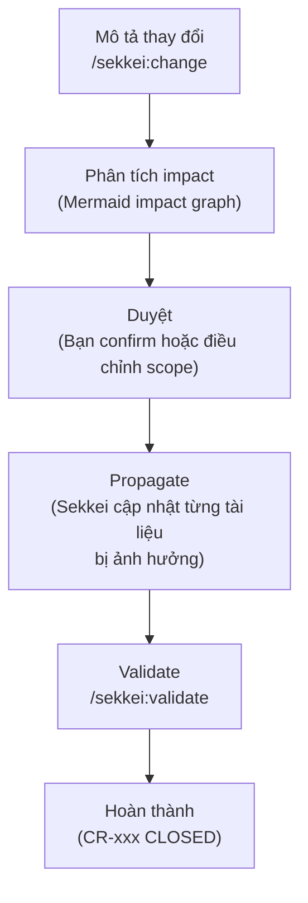
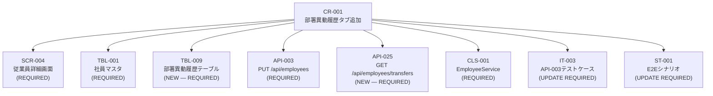

# Change Request — Quản Lý Thay Đổi

Xem thêm: [Workflow Index](./index.md) | [Testing Phase](./03-testing.md) | [V-Model & Tài liệu](../02-v-model-and-documents.md)

---

## Tại sao cần Change Request?

Khi spec đã được duyệt (spec freeze) mà có yêu cầu thay đổi — dù nhỏ như thêm một field vào màn hình — thay đổi đó có thể lan ra nhiều tài liệu theo chuỗi dependency. Ví dụ: thêm trường "部署異動履歴" vào màn hình nhân viên ảnh hưởng đến:

- **SCR-004** trong 基本設計書 (màn hình thay đổi)
- **TBL-001** trong 基本設計書 (thêm bảng hoặc column)
- **API-003** trong 基本設計書 (response schema thay đổi)
- **CLS-001** trong 詳細設計書 (logic mới)
- **IT-003** trong 結合テスト仕様書 (test case cũ invalid)
- **ST-001** trong システムテスト仕様書 (E2E scenario cập nhật)

Nếu không track đầy đủ, bạn sẽ giao bộ tài liệu với nội dung không nhất quán — khách hàng Nhật sẽ phát hiện và yêu cầu làm lại.

Change Request (変更要求書) trong Sekkei là luồng **mô tả thay đổi → phân tích impact → duyệt → propagate → validate** có kiểm soát.

---

## Vòng đời Change Request



---

## Tạo Change Request

```
/sekkei:change
```

Sekkei sẽ hỏi bạn mô tả thay đổi. Ví dụ với HR system:

```
Mô tả thay đổi: Thêm tab "部署異動履歴" vào SCR-004 従業員詳細画面.
Tab này hiển thị lịch sử chuyển bộ phận của nhân viên.
Affected IDs: SCR-004, TBL-001
```

Sekkei phân tích và sinh impact graph:



```
Impact phát hiện: 8 tài liệu/items bị ảnh hưởng
Proceed with CR-001? [Proceed / Edit scope / Stop]
```

---

## Resume, Status, List

Nếu dừng giữa chừng, tiếp tục từ nơi dừng:

```
/sekkei:change --resume CR-001
```

Xem trạng thái CR hiện tại:

```
/sekkei:change --status
```

Output:

```
CR-001  部署異動履歴タブ追加  IN PROGRESS
        Propagated: SCR-004 ✓, TBL-001 ✓, TBL-009 ✓
        Pending:    API-003, API-025, CLS-001, IT-003, ST-001
```

Xem danh sách tất cả CRs trong dự án:

```
/sekkei:change --list
```

---

## Cancel và Rollback

Hủy CR đang mở (chưa propagate hoàn toàn):

```
/sekkei:change --cancel CR-001
```

Sekkei đặt CR-001 về trạng thái CANCELLED và không propagate thêm. Các tài liệu đã được cập nhật một phần sẽ được giữ nguyên — bạn cần review thủ công.

Rollback thay đổi (chỉ hoạt động trong cùng git session):

```
/sekkei:change --rollback CR-001
```

> [!WARNING]
> `--rollback` chỉ hoạt động nếu bạn chưa thoát session git hiện tại. Sekkei dùng git stash/restore để revert — nếu đã commit thì rollback sẽ thất bại. Trong trường hợp đó, dùng `git revert` thủ công.

---

## Quá trình Propagation

Khi bạn chọn **Proceed**, Sekkei cập nhật từng tài liệu theo thứ tự dependency. Với mỗi tài liệu, Sekkei hiển thị diff và chờ confirm:

```
[1/8] Cập nhật SCR-004 従業員詳細画面
  + Tab "部署異動履歴" được thêm vào section 画面レイアウト
  + Mô tả transition đến TBL-009 được thêm vào
  Proceed with this change? [Proceed / Skip / Stop]

[2/8] Cập nhật TBL-001 社員マスタ
  + Foreign key tham chiếu đến TBL-009 được thêm vào
  Proceed with this change? [Proceed / Skip / Stop]
```

**Các lựa chọn:**
- **Proceed** — áp dụng thay đổi và tiếp tục
- **Skip** — bỏ qua tài liệu này (ghi chú "MANUAL REVIEW NEEDED")
- **Stop** — dừng propagation, giữ nguyên những gì đã làm

Sau mỗi tài liệu được cập nhật, Sekkei tự động thêm entry vào **改訂履歴** (revision history) của tài liệu đó:

```
| 2024/09/05 | v1.1 | CR-001: 部署異動履歴タブ追加に伴う更新 | BA Team |
```

---

## Diff Visual

Xem so sánh trực quan trước/sau khi propagate:

```
/sekkei:diff-visual @basic-design-before @basic-design-after
```

Mở preview browser với side-by-side diff, highlight các thay đổi theo màu (thêm: xanh, xóa: đỏ, sửa: vàng). Hữu ích khi cần trình bày thay đổi cho khách hàng trong cuộc họp review.

---

## Validate sau CR

Sau khi propagation hoàn tất, luôn chạy validate để đảm bảo không có broken cross-references:

```
/sekkei:validate
```

Các lỗi thường gặp sau CR:

```
⚠ API-025 (mới) chưa có IT test case nào
⚠ TBL-009 (mới) chưa xuất hiện trong CRUD図
⚠ CLS-001 cập nhật nhưng UT-001 chưa được review
```

Với mỗi lỗi, Sekkei gợi ý lệnh để fix. Ví dụ:
```
→ Chạy /sekkei:it-spec @basic-design để sinh test case cho API-025
→ Chạy /sekkei:matrix để cập nhật CRUD図
```

---

## Checklist hoàn thành CR

- [ ] Mô tả thay đổi rõ ràng, có affected IDs cụ thể
- [ ] Impact graph được review và scope được confirm
- [ ] Tất cả tài liệu bị ảnh hưởng đã được propagate (không có Skip còn mở)
- [ ] 改訂履歴 được tự động thêm vào mỗi tài liệu đã cập nhật
- [ ] `/sekkei:validate` chạy sạch — không có lỗi hay warning
- [ ] Traceability matrix (`/sekkei:matrix`) cập nhật, không có coverage gap mới
- [ ] Export lại bộ tài liệu đã thay đổi (`/sekkei:export --format=xlsx`)
- [ ] Gửi lại khách hàng Nhật với email ghi rõ CR-xxx đã được áp dụng

---

**Xem thêm:** [Tài liệu bổ sung](./04-supplementary.md) | [Role Guides](../05-roles/)
