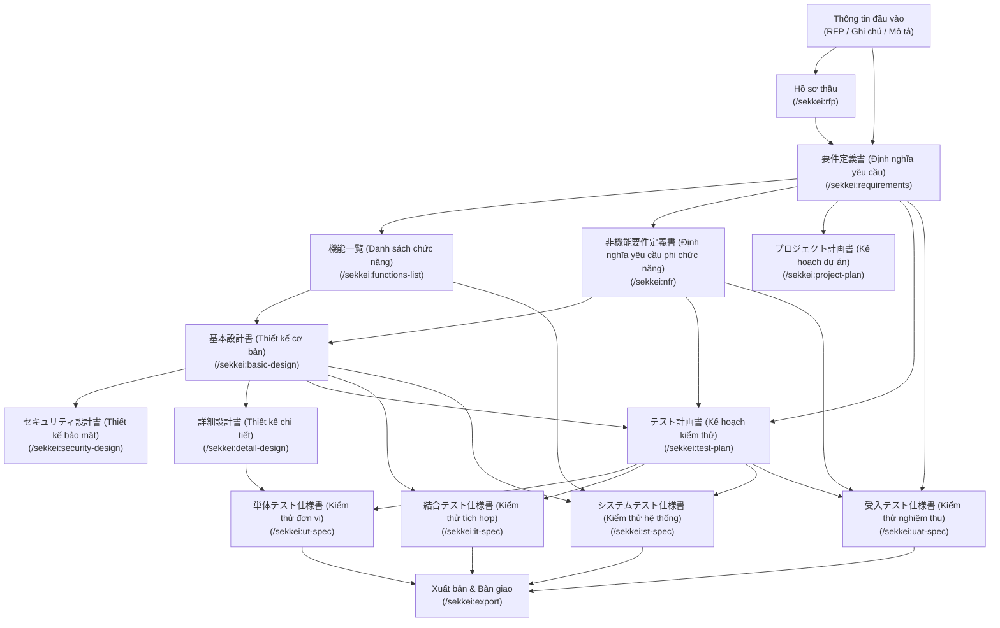

# Tổng quan Quy trình làm việc — Luồng Dự án Sekkei

Xem thêm: [Giới thiệu](../01-introduction.md) | [V-Model và Tài liệu](../02-v-model-and-documents.md) | [Bắt đầu nhanh (Quick Start)](../03-quick-start.md)

---

## Toàn bộ vòng đời của một dự án

Một dự án sử dụng Sekkei sẽ bắt đầu từ các thông tin đầu vào (Input) của bạn (như hồ sơ RFP, ghi chú cuộc họp hoặc mô tả nghiệp vụ), trải qua ba giai đoạn (Phase) cốt lõi: **Yêu cầu → Thiết kế → Kiểm thử**, và kết thúc bằng việc xuất bản bộ hồ sơ chuyên nghiệp để bàn giao cho đối tác Nhật Bản.

Mỗi tài liệu trong chuỗi liên kết sẽ tận dụng kết quả của tài liệu trước đó làm dữ liệu đầu vào. Cách tiếp cận này giúp duy trì một hệ thống mã định danh xuyên suốt (**REQ-xxx → F-xxx → SCR-xxx → UT-xxx**). Điều này không chỉ giúp bạn dễ dàng truy vết tầm ảnh hưởng khi có thay đổi mà còn đảm bảo tính nhất quán tuyệt đối trước khi chính thức bàn giao sản phẩm.

---

## Sơ đồ luồng công việc toàn diện

---

## Tóm tắt theo từng giai đoạn (Phase)

| Phase | Các tài liệu chính | Thời gian dự kiến |
|-------|---------|-------------------|
| **Yêu cầu (Requirements)** | 要件定義書 (Định nghĩa yêu cầu), 機能一覧 (Danh sách chức năng), 非機能 yêu cầu phi chức năng và Kế hoạch dự án. | 1–2 ngày |
| **Thiết kế (Design)** | 基本設計書 (Thiết kế cơ bản), セキュリティ設計書 (Thiết kế bảo mật), 詳細 thiết kế chi tiết. | 2–4 ngày |
| **Kiểm thử (Test)** | テスト計画書 (Kế hoạch kiểm thử) và 4 loại đặc tả kiểm thử cụ thể. | 2–3 ngày |

---

## Các công cụ hỗ trợ xuyên suốt dự án

Hai lệnh dưới đây sẽ giúp bạn kiểm soát chất lượng ở mọi thời điểm:

- **`/sekkei:status`**: Theo dõi tiến độ hoàn thiện của toàn bộ chuỗi hồ sơ.
- **`/sekkei:validate`**: Tự động rà soát sai sót mã ID, đề mục còn thiếu hoặc các tham chiếu không chính xác.

---

## Hướng dẫn chi tiết cho từng giai đoạn

| Giai đoạn | Hướng dẫn chi tiết |
|-------|-------------------|
| Quản lý Yêu cầu (Requirements) | [Chi tiết giai đoạn Requirements](./01-requirements.md) |
| Thiết kế Kỹ thuật (Design) | [Chi tiết giai đoạn Design](./02-design.md) |
| Chiến lược & Đặc tả Kiểm thử (Testing) | [Chi tiết giai đoạn Testing](./03-testing.md) |
| Các tài liệu bổ trợ khác | [Tài liệu bổ sung](./04-supplementary.md) |
| Quy trình xử lý Thay đổi (Change Request) | [Quy trình Change Request](./05-change-request.md) |

---

**Khởi đầu:** Nếu bạn chưa khởi tạo dự án, vui lòng tham khảo [Hướng dẫn Bắt đầu nhanh](../03-quick-start.md). Sau đó, hãy chuyển đến giai đoạn [Quản lý Yêu cầu](./01-requirements.md) để bắt đầu bước thực thi đầu tiên.
Proudly presented by Antigravity.
