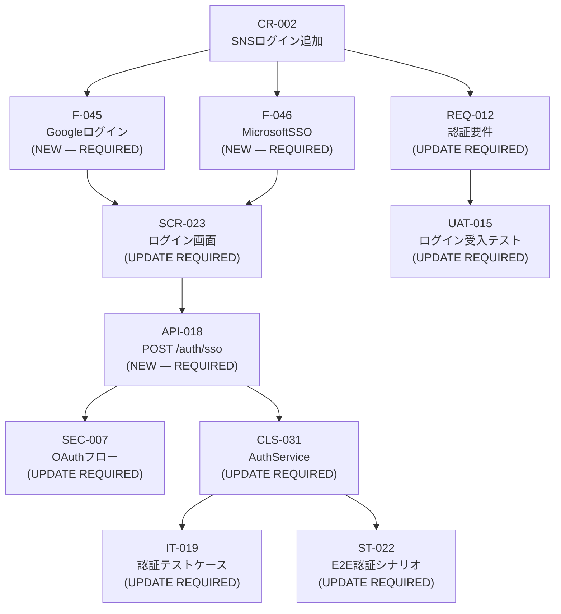

# Kịch bản phối hợp thực tế (Scenarios)

Xem thêm: [Team Playbook](./index.md) | [Danh sách kiểm tra](./02-checklists.md) | [Review & Phê duyệt](./03-review-and-approval.md)

---

Ba kịch bản dưới đây được xây dựng dựa trên một dự án mẫu điển hình: **Hệ thống quản lý nhân sự (人事管理システム)** dành cho doanh nghiệp Nhật Bản, triển khai theo mô hình SaaS với quy mô khoảng 20–30 tính năng chính.

---

## Kịch bản 1: Triển khai dự án mới từ đầu

**Bối cảnh:** Đội ngũ nhận được hồ sơ yêu cầu (RFP) từ khách hàng Nhật cho hệ thống HRM. Phạm vi công việc: Quản lý hồ sơ nhân viên, chấm công, tính lương và báo cáo nhân sự. Thời hạn hoàn thiện bộ hồ sơ đặc tả: 3 tuần.

---

### Tuần 1: Xử lý RFP và Thiết lập Yêu cầu

**Ngày 1–2: Giai đoạn Sales & Tư vấn giải pháp**

Sales đưa nội dung hồ sơ thầu vào hệ thống:
```bash
/sekkei:rfp @rfp-hr-system-2024.pdf
```
Sekkei sẽ tự động phân tích và đưa ra danh sách Q&A. Sales rà soát, bổ sung các câu hỏi chuyên sâu về nghiệp vụ (Ví dụ: "Hệ thống có cần đồng bộ dữ liệu với phần mềm kế toán sẵn có không?"). Sau khi nhận phản hồi và chốt phạm vi với khách hàng, Sales thực hiện lệnh đóng băng phạm vi:
```bash
SCOPE_FREEZE
```
Hệ thống tạo file `06_scope_freeze.md`. Sales xuất bản bản lưu trữ và gửi khách hàng ký xác nhận.

```
/sekkei:export @scope-freeze --format=pdf
```

**Ngày 3: Giai đoạn Phân tích nghiệp vụ (BA)**

BA tiếp nhận phạm vi đã chốt để triển khai đặc tả yêu cầu:
```bash
/sekkei:requirements @06_scope_freeze.md
```
Lúc này, BA cần kiểm tra kỹ lưỡng các mã REQ-xxx, đảm bảo các quy tắc nghiệp vụ về nhân sự (như chu kỳ chấm công, công thức tính lương) được mô tả chính xác.

**Ngày 3–4: Hoàn thiện danh mục chức năng và Kế hoạch**

BA triển khai đồng thời danh sách chức năng và yêu cầu phi chức năng:
```bash
# BA — Terminal 1
/sekkei:functions-list @requirements

# BA — Terminal 2 (song song)
/sekkei:nfr @requirements
```
PM tiến hành xây dựng kế hoạch dự án dựa trên các yêu cầu này:
```
# PM — Terminal 3 (song song)
/sekkei:project-plan @requirements
```
BA cũng bổ sung các thuật ngữ chuyên ngành vào Glossary như: **人事管理モジュール (Module quản lý nhân sự)**, **給与計算エンジン (Công cụ tính lương)**, **勤怠管理 (Quản lý chấm công)**...
```
/sekkei:glossary add
# Thêm: 人事管理モジュール, 給与計算エンジン, 勤怠管理, etc.
```

**Ngày 5: Kiểm soát chất lượng giai đoạn 1 (Gate 1)**

PM thực hiện xác thực toàn bộ kết quả của Phase Requirements trước khi chuyển sang giai đoạn Thiết kế.
```
# PM validate trước khi chuyển sang Design
/sekkei:validate @requirements
/sekkei:validate @functions-list
/sekkei:validate @nfr
```
Khi mọi thứ đã ổn thỏa, PM xuất bản hồ sơ để phê duyệt nội bộ.
```
Nếu pass, PM export để gửi stakeholder review:

```
/sekkei:export @requirements --format=pdf
```

→ Handoff: BA bàn giao requirements + functions-list + nfr cho Dev Lead.

---

### Tuần 2: Giai đoạn Thiết kế hệ thống

**Ngày 6: Xây dựng Thiết kế kiến trúc (Architecture Design)**

Dev Lead khởi tạo thiết kế kiến trúc cấp cao trước:
```
/sekkei:architecture-design @requirements @nfr @functions-list
```

**Ngày 7–8: Xây dựng Thiết kế cơ bản (Basic Design)**

Dev Lead triển khai:
```
/sekkei:basic-design @requirements @functions-list
```
Rà soát kỹ các thành phần:
- **SCR-xxx**: Đã đủ các màn hình quản lý nhân viên và bảng lương chưa?
- **TBL-xxx**: Cấu trúc bảng dữ liệu có tối ưu không?
- **API-xxx**: Các cổng giao tiếp đã tuân thủ chuẩn RESTful chưa?

Với quy mô hơn 20 tính năng, Dev Lead kích hoạt chế độ tách file (Split Mode) trong file cấu hình để quản lý dễ dàng hơn.
```yaml
# sekkei.config.yaml
output:
  split: true
  split_by: module
```

**Ngày 9–10: Thiết kế Bảo mật, Chi tiết và Cơ sở Dữ liệu**

Triển khai song song các tài liệu thiết kế tiếp theo để đảm bảo tiến độ:
```
# Terminal 1
/sekkei:security-design @basic-design

# Terminal 2 (song song)
/sekkei:detail-design @basic-design

# Terminal 3 (song song)
/sekkei:db-design @basic-design
```

**Ngày 10: Kiểm soát chất lượng giai đoạn 2 (Gate 2)**

PM chạy lệnh xác thực thiết kế.
```
/sekkei:validate @architecture-design
/sekkei:validate @basic-design
/sekkei:validate @detail-design
/sekkei:validate @db-design
```
Nếu đạt yêu cầu, Dev Lead chính thức bàn giao hồ sơ thiết kế cho đội ngũ QA.

---

### Tuần 3: Giai đoạn Kiểm thử

**Ngày 11–12: Lập Kế hoạch kiểm thử**

QA khởi tạo chiến lược kiểm thử tổng thể:
```
/sekkei:test-plan @requirements @nfr @basic-design
```

**Ngày 13–14: Triển khai 4 bộ đặc tả kiểm thử**

QA chạy song song các kịch bản kiểm thử: Đơn vị (UT), Tích hợp (IT), Hệ thống (ST) và Nghiệm thu (UAT).
```
# Terminal 1
/sekkei:ut-spec @detail-design @test-plan

# Terminal 2
/sekkei:it-spec @basic-design @test-plan

# Terminal 3
/sekkei:st-spec @basic-design @functions-list @test-plan

# Terminal 4
/sekkei:uat-spec @requirements @nfr @test-plan
```
BA cùng tham gia rà soát kịch bản UAT để đảm bảo chúng phản ánh đúng các yêu cầu nghiệp vụ nhân sự ban đầu.

**Ngày 15: Hoàn tất Ma trận truy xuất nguồn gốc**

QA thực hiện lệnh tạo ma trận để kiểm chứng độ bao phủ 100% của việc kiểm thử đối với từng yêu cầu nghiệp vụ.
```
/sekkei:matrix
/sekkei:validate
```
Kiểm tra coverage: mỗi REQ-xxx phải có ít nhất 1 test case.

---

### Bàn giao sản phẩm (Delivery)

PM thực hiện xuất bản toàn bộ bộ tài liệu ra định dạng Excel chuẩn Nhật.
```
/sekkei:export @requirements --format=xlsx
/sekkei:export @functions-list --format=xlsx
/sekkei:export @nfr --format=xlsx
/sekkei:export @architecture-design --format=xlsx
/sekkei:export @basic-design --format=xlsx
/sekkei:export @security-design --format=xlsx
/sekkei:export @detail-design --format=xlsx
/sekkei:export @db-design --format=xlsx
/sekkei:export @test-plan --format=xlsx
/sekkei:export @ut-spec --format=xlsx
/sekkei:export @it-spec --format=xlsx
/sekkei:export @st-spec --format=xlsx
/sekkei:export @uat-spec --format=xlsx
```
Sau đó, đóng gói hồ sơ (gồm bản Excel và PDF) để gửi khách hàng. Export thêm PDF bộ tài liệu chính (requirements + basic-design + uat-spec) để dùng trong buổi trình bày.

---

## Kịch bản 2: Xử lý thay đổi yêu cầu giữa dự án

**Bối cảnh:** Giai đoạn thiết kế đã kết thúc. Khách hàng bất ngờ yêu cầu bổ sung tính năng đăng nhập bằng mạng xã hội (Google, Microsoft) cho hệ thống HRM. Thay đổi này ảnh hưởng trực tiếp đến **認証要件 (Yêu cầu xác thực)**.

**Impact chain dự kiến:**
`REQ-012 → F-045, F-046 → SCR-023 (ログイン画面) → API-018 (POST /auth/sso) → SEC-007 (OAuthフロー) → CLS-031 (AuthService) → IT-019, ST-022, UAT-015`

---

### Các bước xử lý Change Request

**Bước 1: BA xác định thay đổi và tạo git checkpoint**

```bash
git add -A && git commit -m "checkpoint: before CR-002 SNS login"
```

**Bước 2: BA chạy Change Request**

```
/sekkei:change
```

Sekkei hỏi mô tả thay đổi. BA nhập:

```
Mô tả: Thêm tính năng đăng nhập bằng SNS (Google OAuth, Microsoft SSO)
       vào màn hình đăng nhập SCR-023.
       Client yêu cầu nhân viên có thể dùng corporate Google/Microsoft account.
Affected IDs: REQ-012, SCR-023
```

**Bước 3: Sekkei sinh impact graph**



```
Impact phát hiện: 10 items bị ảnh hưởng
Proceed with CR-002? [Proceed / Edit scope / Stop]
```

**Bước 4: PM review impact graph và approve**

PM xem impact, confirm scope hợp lý → chọn **Proceed**.

**Bước 5: Propagate từng tài liệu**

Sekkei cập nhật theo thứ tự dependency, mỗi bước hiện diff và chờ confirm:

```
[1/10] Cập nhật REQ-012 認証要件
  + Thêm OAuth2.0 / SAML 2.0 requirements
  + Thêm external IdP integration requirements
  Proceed with this change? [Proceed / Skip / Stop]

[2/10] Tạo mới F-045 Googleログイン機能
  + Feature definition + acceptance criteria
  Proceed? [Proceed / Skip / Stop]

...và tiếp tục cho đến [10/10]
```

Sau mỗi tài liệu, Sekkei tự động thêm entry vào **改訂履歴 (Lịch sử sửa đổi)**:

```
| 2024/11/20 | v1.2 | CR-002: SNSログイン機能追加に伴う更新 | BA Team |
```

**Bước 6: Validate full chain sau CR**

```
/sekkei:validate
```

Fix nếu có broken cross-references (ví dụ: API-018 mới chưa có IT test case → Sekkei gợi ý `→ Chạy /sekkei:it-spec để sinh test case cho API-018`).

**Bước 7: Diff visual để trình bày cho khách hàng**

```
/sekkei:diff-visual @basic-design-before @basic-design-after
```

Mở preview với side-by-side diff, highlight thay đổi (thêm: xanh, xóa: đỏ, sửa: vàng). Hữu ích trong buổi họp review với khách hàng Nhật.

**Bước 8: Export lại các tài liệu đã thay đổi**

```
/sekkei:export @requirements --format=xlsx
/sekkei:export @basic-design --format=xlsx
/sekkei:export @security-design --format=xlsx
/sekkei:export @it-spec --format=xlsx
/sekkei:export @st-spec --format=xlsx
/sekkei:export @uat-spec --format=xlsx
```

Gửi lại khách hàng với email ghi rõ: "CR-002 đã được áp dụng vào các tài liệu đính kèm."

---

## Kịch bản 3: Kiểm toán chất lượng trước khi bàn giao

**Bối cảnh:** Dự án HRM chuẩn bị về đích. Để đảm bảo khách hàng Nhật hài lòng tuyệt đối, PM dẫn dắt một buổi kiểm soát chất lượng (Audit) nội bộ.

---

### Bước 1: PM chạy full validate — kiểm tra toàn bộ chain

```
/sekkei:validate
```

Xử lý từng warning xuất hiện:

```
# Ví dụ các lỗi thường gặp:
⚠ REQ-045 không có F-xxx nào map tới
⚠ TBL-007 xuất hiện trong basic-design nhưng không có test case trong st-spec
⚠ API-018 mới tạo chưa có IT test case

# Fix theo gợi ý của Sekkei, ví dụ:
→ /sekkei:it-spec @basic-design  (cập nhật thêm test case cho API-018)
```

Chạy lại validate cho đến khi clean:

```
/sekkei:validate
# → All checks passed. No broken cross-references.
```

### Bước 2: QA chạy Traceability Matrix — kiểm tra coverage

```
/sekkei:matrix
```

Mục tiêu: mỗi REQ-xxx trong hệ thống quản lý nhân sự phải có ít nhất 1 test case (UT/IT/ST/UAT). Nếu có REQ orphaned:

```
# Sinh thêm test cases cho REQ còn thiếu
/sekkei:uat-spec @requirements  # cập nhật UAT spec
/sekkei:matrix  # chạy lại để confirm 100% coverage
```

### Bước 3: Export toàn bộ bộ tài liệu ra Excel

```
/sekkei:export @requirements --format=xlsx
/sekkei:export @nfr --format=xlsx
/sekkei:export @project-plan --format=xlsx
/sekkei:export @architecture-design --format=xlsx
/sekkei:export @basic-design --format=xlsx
/sekkei:export @security-design --format=xlsx
/sekkei:export @detail-design --format=xlsx
/sekkei:export @db-design --format=xlsx
/sekkei:export @test-plan --format=xlsx
/sekkei:export @ut-spec --format=xlsx
/sekkei:export @it-spec --format=xlsx
/sekkei:export @st-spec --format=xlsx
/sekkei:export @uat-spec --format=xlsx
```

### Bước 4: Review từng file Excel — kiểm tra cấu trúc IPA 4-sheet

Mở từng file Excel và xác nhận 4 sheet theo chuẩn IPA:

| Sheet | Nội dung |
|-------|----------|
| 表紙 (Trang bìa) | Tên tài liệu, version, ngày, tên công ty |
| 改訂履歴 (Lịch sử sửa đổi) | Lịch sử thay đổi — mỗi phiên bản có entry đầy đủ |
| 目次 (Mục lục) | Mục lục tự động — phải match nội dung thực tế |
| 本文 (Nội dung chính) | Nội dung chính — format và cross-ref IDs đúng |

### Bước 5: (Optional) Dịch UAT sang tiếng Anh cho stakeholder nội bộ

```
/sekkei:translate @uat-spec --lang=en
/sekkei:export @uat-spec-en --format=pdf
```

### Bước 6: Đóng gói và giao hàng

Tạo ZIP bundle:

```bash
zip -r hr-system-docs-v1.0-$(date +%Y%m%d).zip workspace-docs/
```

### Audit Checklist trước giao hàng

- [ ] `/sekkei:validate` chạy clean — zero warnings, zero errors
- [ ] `/sekkei:matrix` xác nhận 100% REQ coverage
- [ ] Tất cả file Excel có đủ 4 sheet: 表紙 (Trang bìa), 改訂履歴 (Lịch sử sửa đổi), 目次 (Mục lục), 本文 (Nội dung chính)
- [ ] 改訂履歴 (Lịch sử sửa đổi) có entries đầy đủ — không có khoảng trống giữa các version
- [ ] Tên tài liệu, version, ngày trên 表紙 (Trang bìa) nhất quán với thực tế
- [ ] Cross-reference IDs (REQ → F → SCR → UT/IT/ST/UAT) trace được xuyên suốt
- [ ] PDF bundle của requirements + basic-design + uat-spec đã sẵn sàng cho buổi presentation
- [ ] Nếu có CR đã xử lý: diff-visual đã được lưu để trình bày thay đổi
- [ ] ZIP bundle đã được đặt tên với version và ngày rõ ràng
- [ ] PM đã final approve trước khi gửi cho khách hàng

---

**Xem thêm:** [Danh sách kiểm tra](./02-checklists.md) | [Review & Phê duyệt](./03-review-and-approval.md) | [Quy trình Quản lý Thay đổi](../04-workflow/05-change-request.md)

