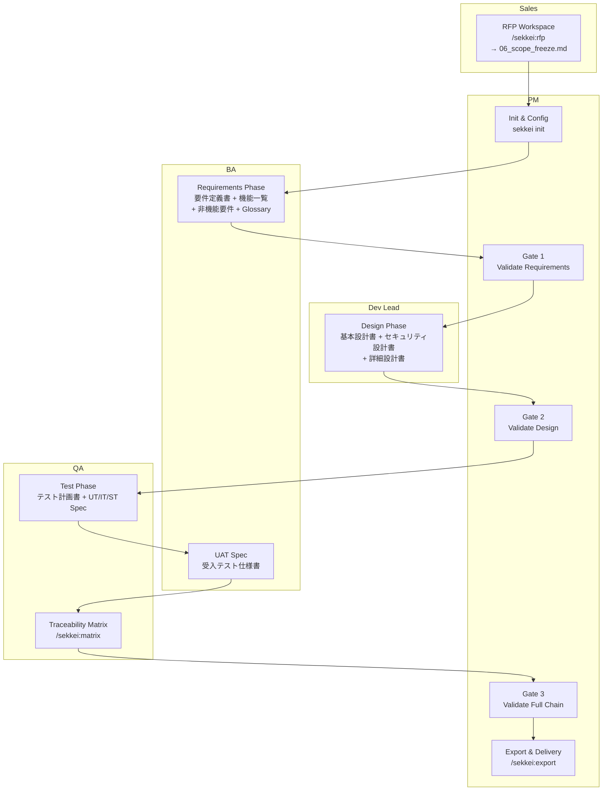

# Team Playbook — Phối Hợp Nhóm với Sekkei

Xem thêm: [Giới thiệu](../01-introduction.md) | [Workflow Overview](../04-workflow/index.md) | [Quick Start](../03-quick-start.md)

---

## Giới thiệu Team Playbook

Sekkei là công cụ dành cho cả team — không phải một người làm hết. Sales khởi động từ RFP, BA xây dựng requirements, Dev Lead thiết kế, QA viết specs, PM giám sát và gate mỗi phase. Mỗi vai trò can thiệp đúng lúc, đúng chỗ, và handoff rõ ràng sang người tiếp theo.

Playbook này cho bạn biết: ai làm gì, khi nào, và bàn giao cái gì.

---

## Cấu trúc team và phân công theo phase

---

## RACI Matrix

R = Responsible (người thực hiện) | A = Accountable (người chịu trách nhiệm) | C = Consulted (người được hỏi ý kiến) | I = Informed (người được thông báo)

| Phase / Tài liệu | PM | BA | Dev Lead | QA | Sales |
|-----------------|----|----|----------|----|-------|
| RFP | A | R | C | — | R |
| 要件定義書 | A | R | C | I | — |
| 機能一覧 | I | R | C | I | — |
| 非機能要件定義書 | A | R | C | I | — |
| プロジェクト計画書 | R | C | C | — | — |
| 基本設計書 | A | C | R | I | — |
| セキュリティ設計書 | I | — | R | C | — |
| 詳細設計書 | I | — | R | C | — |
| テスト計画書 | A | C | C | R | — |
| UT/IT/ST仕様書 | I | — | C | R | — |
| 受入テスト仕様書 | A | C | — | R | — |
| Review / Approve | R | C | C | C | — |
| Export / Delivery | R | — | — | C | C |

---

## Tool Setup theo vai trò

| Vai trò | Cần thiết | Optional |
|---------|-----------|----------|
| PM | `sekkei init`, Claude Code | Preview server |
| BA | Claude Code + Sekkei skill | Preview `--edit` |
| Dev Lead | Claude Code + Sekkei skill | Preview `--edit` |
| QA | Claude Code + Sekkei skill | Preview |
| Sales | Claude Code + Sekkei skill | Preview |

Cài Sekkei skill một lần: copy `sekkei/skills/sekkei/SKILL.md` vào `~/.claude/skills/sekkei/SKILL.md`.

---

## Handoff Points — 4 điểm bàn giao chính

**Handoff 1 — Sales → BA:** Scope freeze hoàn tất.
Bàn giao: `05_proposal.md` + `06_scope_freeze.md` làm input cho requirements phase.

**Handoff 2 — BA → Dev Lead:** Requirements validated, PM đã approve Gate 1.
Bàn giao: 要件定義書 + 機能一覧 + 非機能要件定義書 (tất cả đã pass `/sekkei:validate`).

**Handoff 3 — Dev Lead → QA:** Design validated, PM đã approve Gate 2.
Bàn giao: 基本設計書 + セキュリティ設計書 + 詳細設計書 (pass validate, CLS-xxx đầy đủ).

**Handoff 4 — QA → PM:** Full chain validated, matrix 100% coverage.
Bàn giao: Toàn bộ test specs + traceability matrix → PM export để giao khách hàng.

---

## Điều hướng Team Playbook

| Tài liệu | Nội dung |
|----------|----------|
| [scenarios.md](./01-scenarios.md) | 3 tình huống thực tế với toàn bộ chuỗi lệnh |
| [checklists.md](./02-checklists.md) | Checklist từng phase — copy-paste sẵn |
| [review-and-approval.md](./03-review-and-approval.md) | Quy tắc review, approval chain, quality gates |

Muốn xem hướng dẫn theo vai trò: [roles/](../05-roles/)
