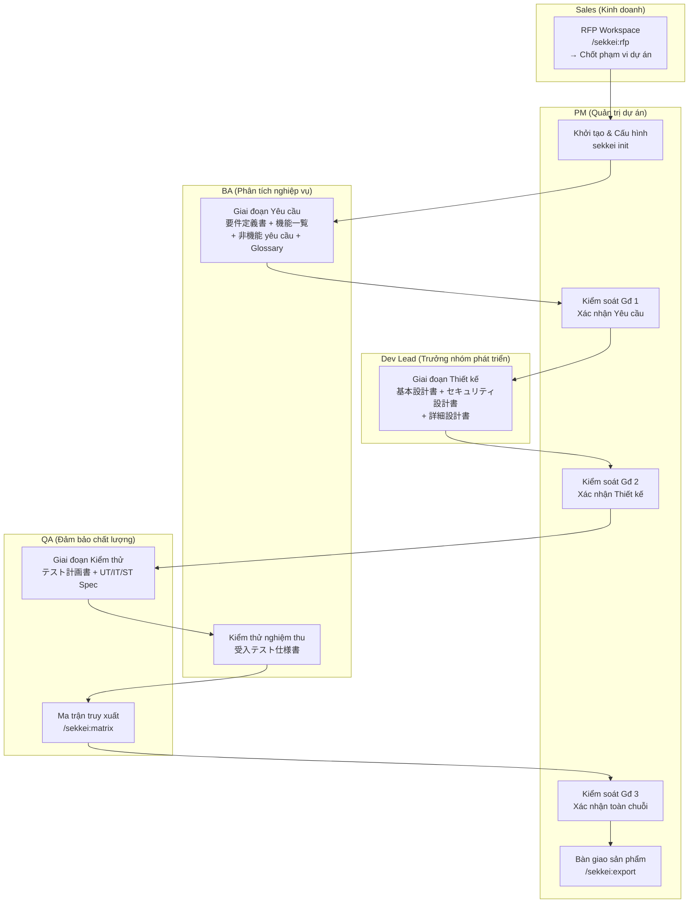

# Team Playbook — Phối hợp Nhóm Hiệu quả với Sekkei

Xem thêm: [Giới thiệu](../01-introduction.md) | [Tổng quan quy trình](../04-workflow/index.md) | [Bắt đầu nhanh (Quick Start)](../03-quick-start.md)

---

## Giới thiệu Team Playbook

Sekkei không chỉ là công cụ cá nhân, nó được thiết kế để kết nối toàn bộ đội ngũ. Sales khởi động từ RFP, BA xây dựng đặc tả yêu cầu, Dev Lead phụ trách thiết kế hệ thống, QA hoàn thiện bộ kịch bản kiểm thử, trong khi PM đóng vai trò điều phối và kiểm soát chất lượng tại mỗi giai đoạn. Mỗi thành viên sẽ can thiệp vào đúng thời điểm, thực hiện đúng vai trò và bàn giao kết quả rõ ràng cho người tiếp theo.

Playbook này sẽ hướng dẫn chi tiết: **Ai làm gì, Khi nào thực hiện và Bàn giao những gì?**

---

## Cấu trúc đội ngũ và Phân công theo giai đoạn

---

## Ma trận Trách nhiệm (RACI Matrix)

*R = Chịu trách nhiệm thực hiện (Responsible) | A = Chịu trách nhiệm giải trình (Accountable) | C = Tham vấn (Consulted) | I = Nhận thông tin (Informed)*

| Giai đoạn / Tài liệu | PM | BA | Dev Lead | QA | Sales |
|-----------------|----|----|----------|----|-------|
| Phân tích RFP | A | R | C | — | R |
| **要件定義書** (Yêu cầu) | A | R | C | I | — |
| **機能一覧** (Chức năng) | I | R | C | I | — |
| **非機能要件定義書** (Phi chức năng) | A | R | C | I | — |
| **プロジェクト計画書** (Kế hoạch dự án) | R | C | C | — | — |
| **基本設計書** (Thiết kế cơ bản) | A | C | R | I | — |
| **セキュリティ設計書** (Bảo mật) | I | — | R | C | — |
| **詳細設計書** (Thiết kế chi tiết) | I | — | R | C | — |
| **テスト計画書** (Kế hoạch kiểm thử) | A | C | C | R | — |
| UT/IT/ST Especifics | I | — | C | R | — |
| **受入テスト仕様書** (UAT) | A | C | — | R | — |
| Phê duyệt giai đoạn | R | C | C | C | — |
| Xuất bản & Bàn giao | R | — | — | C | C |

---

## Các điểm bàn giao chính (Handoff Points)

**1. Bàn giao từ Sales sang BA:** Đã đóng băng phạm vi công việc.
- Nội dung: Hồ sơ đề xuất và file Scope Freeze để làm đầu vào cho giai đoạn Định nghĩa yêu cầu.

**2. Bàn giao từ BA sang Dev Lead:** Yêu cầu đã được xác thực, PM đã phê duyệt giai đoạn 1.
- Nội dung: **要件定義書**, **機能一覧** và **非機能要件定義書** (Tất cả đã vượt qua lệnh `/sekkei:validate`).

**3. Bàn giao từ Dev Lead sang QA:** Thiết kế đã được xác thực, PM đã phê duyệt giai đoạn 2.
- Nội dung: **基本設計書**, **セキュリティ設計書** và **詳細設計書** (Mã ID nhất quán, CLS-xxx đầy đủ).

**4. Bàn giao từ QA sang PM:** Toàn bộ chuỗi tài liệu đã xác thực, ma trận đạt độ bao phủ 100%.
- Nội dung: Toàn bộ Đặc tả kiểm thử và Ma trận truy xuất nguồn gốc để PM thực hiện xuất bản bàn giao.

---

## Tài liệu trong Team Playbook

| Tài liệu | Nội dung |
|----------|----------|
| [Kịch bản phối hợp thực tế](./01-scenarios.md) | 3 tình huống điển hình với chuỗi câu lệnh mẫu. |
| [Danh sách kiểm tra (Checklists)](./02-checklists.md) | Checklist cho từng giai đoạn, sẵn sàng để copy-paste. |
| [Quy tắc Review & Phê duyệt](./03-review-and-approval.md) | Quy định về phê duyệt, kiểm soát chất lượng. |

---

Hướng dẫn chi tiết theo vai trò: [roles/](../05-roles/)
