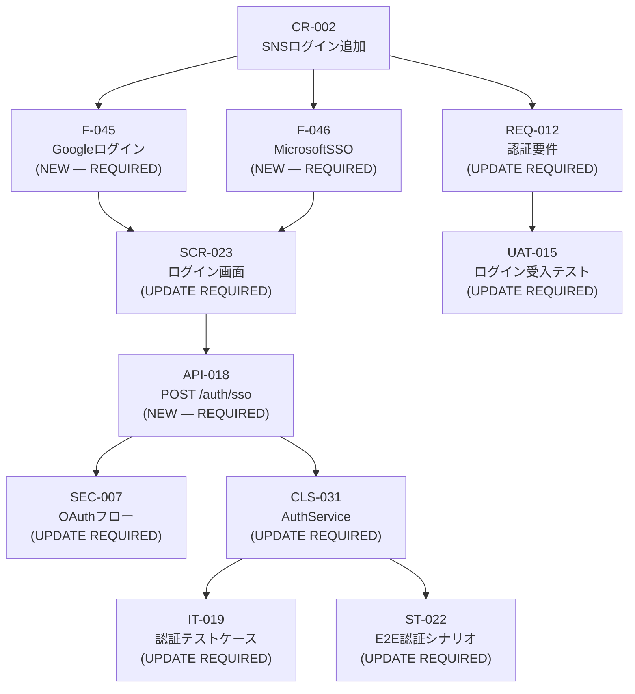

# Scenarios — Tình Huống Thực Tế

Xem thêm: [Team Playbook](./index.md) | [Checklists](./checklists.md) | [Review & Approval](./review-and-approval.md)

---

Ba tình huống dưới đây dùng cùng một dự án mẫu: **hệ thống quản lý nhân sự** (人事管理システム) cho công ty Nhật, SaaS, khoảng 20–30 tính năng chính.

---

## Scenario 1: Dự án mới từ đầu

**Bối cảnh:** Team nhận RFP từ khách hàng Nhật cho hệ thống quản lý nhân sự. Scope: quản lý nhân viên, chấm công, tính lương, báo cáo HR. Timeline: 3 tuần tài liệu hoá.

---

### Tuần 1 — RFP & Requirements

**Ngày 1–2: Sales chạy RFP Workspace**

```
# Sales paste RFP từ khách hàng
/sekkei:rfp @rfp-hr-system-2024.pdf
```

Sekkei sinh danh sách Q&A tự động. Sales review, xóa câu thừa, thêm câu domain-specific (ví dụ: "Hệ thống có cần tích hợp với phần mềm kế toán hiện tại?").

```
# Gửi Q&A cho khách hàng, chờ trả lời
# Khi khách hàng trả lời:
CLIENT_ANSWERED: [Paste toàn bộ câu trả lời]
```

Sau khi confirm scope với khách hàng:

```
SCOPE_FREEZE
```

→ Sekkei tạo `06_scope_freeze.md`. Sales export PDF và gửi khách hàng ký xác nhận.

```
/sekkei:export @scope-freeze --format=pdf
```

**Ngày 3: BA nhận handoff, tạo Requirements**

```
# BA dùng scope-freeze làm input
/sekkei:requirements @06_scope_freeze.md
```

Review output kỹ: REQ-xxx IDs đủ chưa, business rules của HR system có đúng không (ví dụ: quy tắc tính lương, chu kỳ chấm công).

**Ngày 3–4: BA chạy song song 3 tài liệu, PM tạo project plan**

```
# BA — Terminal 1
/sekkei:functions-list @requirements

# BA — Terminal 2 (song song)
/sekkei:nfr @requirements

# PM — Terminal 3 (song song)
/sekkei:project-plan @requirements
```

BA thêm glossary cho các term HR-specific:

```
/sekkei:glossary add
# Thêm: 人事管理モジュール, 給与計算エンジン, 勤怠管理, etc.
```

**Ngày 5: PM chạy Gate 1**

```
# PM validate trước khi chuyển sang Design
/sekkei:validate @requirements
/sekkei:validate @functions-list
/sekkei:validate @nfr
```

Nếu pass, PM export để gửi stakeholder review:

```
/sekkei:export @requirements --format=pdf
```

→ Handoff: BA bàn giao requirements + functions-list + nfr cho Dev Lead.

---

### Tuần 2 — Design

**Ngày 6–7: Dev Lead tạo Basic Design**

```
/sekkei:basic-design @requirements @functions-list
```

Dev Lead review kỹ:
- SCR-xxx: đủ screens chưa? Màn hình quản lý nhân viên, chấm công, bảng lương?
- TBL-xxx: schema hợp lý? Primary/foreign keys rõ ràng?
- API-xxx: RESTful chuẩn? Đủ CRUD cho các entity chính?

Dự án HR 20–30 features → bật split mode:

```yaml
# sekkei.config.yaml
output:
  split: true
  split_by: module
```

**Ngày 8–9: Dev Lead chạy song song Security + Detail Design**

```
# Terminal 1
/sekkei:security-design @basic-design

# Terminal 2 (song song)
/sekkei:detail-design @basic-design
```

**Ngày 10: PM chạy Gate 2**

```
/sekkei:validate @basic-design
/sekkei:validate @detail-design
```

→ Nếu pass, Dev Lead handoff sang QA.

---

### Tuần 3 — Testing

**Ngày 11–12: QA tạo Test Plan**

```
/sekkei:test-plan @requirements @nfr @basic-design
```

**Ngày 13–14: QA chạy song song 4 test specs**

```
# Terminal 1
/sekkei:ut-spec @detail-design @test-plan

# Terminal 2
/sekkei:it-spec @basic-design @test-plan

# Terminal 3
/sekkei:st-spec @basic-design @functions-list @test-plan

# Terminal 4
/sekkei:uat-spec @requirements @nfr @test-plan
```

BA review UAT spec — đảm bảo UAT scenarios map đúng về REQ-xxx HR system.

**Ngày 15: QA chạy Traceability Matrix + Full Validate**

```
/sekkei:matrix
/sekkei:validate
```

Kiểm tra coverage: mỗi REQ-xxx phải có ít nhất 1 test case.

---

### Delivery

PM export toàn bộ bộ tài liệu:

```
/sekkei:export @requirements --format=xlsx
/sekkei:export @functions-list --format=xlsx
/sekkei:export @nfr --format=xlsx
/sekkei:export @basic-design --format=xlsx
/sekkei:export @security-design --format=xlsx
/sekkei:export @detail-design --format=xlsx
/sekkei:export @test-plan --format=xlsx
/sekkei:export @ut-spec --format=xlsx
/sekkei:export @it-spec --format=xlsx
/sekkei:export @st-spec --format=xlsx
/sekkei:export @uat-spec --format=xlsx
```

Đóng gói ZIP và giao khách hàng. Export thêm PDF bộ tài liệu chính (requirements + basic-design + uat-spec) để dùng trong buổi trình bày.

---

## Scenario 2: Thay đổi giữa dự án

**Bối cảnh:** Design phase đã hoàn tất. Khách hàng yêu cầu thêm tính năng đăng nhập bằng SNS (Google, Microsoft) vào hệ thống quản lý nhân sự. Thay đổi này ảnh hưởng đến REQ-012 (認証要件).

**Impact chain dự kiến:**
`REQ-012 → F-045, F-046 → SCR-023 (ログイン画面) → API-018 (POST /auth/sso) → SEC-007 (OAuthフロー) → CLS-031 (AuthService) → IT-019, ST-022, UAT-015`

---

### Các bước xử lý Change Request

**Bước 1: BA xác định thay đổi và tạo git checkpoint**

```bash
git add -A && git commit -m "checkpoint: before CR-002 SNS login"
```

**Bước 2: BA chạy Change Request**

```
/sekkei:change
```

Sekkei hỏi mô tả thay đổi. BA nhập:

```
Mô tả: Thêm tính năng đăng nhập bằng SNS (Google OAuth, Microsoft SSO)
       vào màn hình đăng nhập SCR-023.
       Client yêu cầu nhân viên có thể dùng corporate Google/Microsoft account.
Affected IDs: REQ-012, SCR-023
```

**Bước 3: Sekkei sinh impact graph**



```
Impact phát hiện: 10 items bị ảnh hưởng
Proceed with CR-002? [Proceed / Edit scope / Stop]
```

**Bước 4: PM review impact graph và approve**

PM xem impact, confirm scope hợp lý → chọn **Proceed**.

**Bước 5: Propagate từng tài liệu**

Sekkei cập nhật theo thứ tự dependency, mỗi bước hiện diff và chờ confirm:

```
[1/10] Cập nhật REQ-012 認証要件
  + Thêm OAuth2.0 / SAML 2.0 requirements
  + Thêm external IdP integration requirements
  Proceed with this change? [Proceed / Skip / Stop]

[2/10] Tạo mới F-045 Googleログイン機能
  + Feature definition + acceptance criteria
  Proceed? [Proceed / Skip / Stop]

...và tiếp tục cho đến [10/10]
```

Sau mỗi tài liệu, Sekkei tự động thêm entry vào 改訂履歴:

```
| 2024/11/20 | v1.2 | CR-002: SNSログイン機能追加に伴う更新 | BA Team |
```

**Bước 6: Validate full chain sau CR**

```
/sekkei:validate
```

Fix nếu có broken cross-references (ví dụ: API-018 mới chưa có IT test case → Sekkei gợi ý `→ Chạy /sekkei:it-spec để sinh test case cho API-018`).

**Bước 7: Diff visual để trình bày cho khách hàng**

```
/sekkei:diff-visual @basic-design-before @basic-design-after
```

Mở preview với side-by-side diff, highlight thay đổi (thêm: xanh, xóa: đỏ, sửa: vàng). Hữu ích trong buổi họp review với khách hàng Nhật.

**Bước 8: Export lại các tài liệu đã thay đổi**

```
/sekkei:export @requirements --format=xlsx
/sekkei:export @basic-design --format=xlsx
/sekkei:export @security-design --format=xlsx
/sekkei:export @it-spec --format=xlsx
/sekkei:export @st-spec --format=xlsx
/sekkei:export @uat-spec --format=xlsx
```

Gửi lại khách hàng với email ghi rõ: "CR-002 đã được áp dụng vào các tài liệu đính kèm."

---

## Scenario 3: Chuẩn bị audit trước giao hàng

**Bối cảnh:** Dự án hệ thống quản lý nhân sự sắp giao hàng. Khách hàng Nhật yêu cầu kiểm tra chất lượng tài liệu trước khi nghiệm thu. PM dẫn dắt audit session.

---

### Bước 1: PM chạy full validate — kiểm tra toàn bộ chain

```
/sekkei:validate
```

Xử lý từng warning xuất hiện:

```
# Ví dụ các lỗi thường gặp:
⚠ REQ-045 không có F-xxx nào map tới
⚠ TBL-007 xuất hiện trong basic-design nhưng không có test case trong st-spec
⚠ API-018 mới tạo chưa có IT test case

# Fix theo gợi ý của Sekkei, ví dụ:
→ /sekkei:it-spec @basic-design  (cập nhật thêm test case cho API-018)
```

Chạy lại validate cho đến khi clean:

```
/sekkei:validate
# → All checks passed. No broken cross-references.
```

### Bước 2: QA chạy Traceability Matrix — kiểm tra coverage

```
/sekkei:matrix
```

Mục tiêu: mỗi REQ-xxx trong hệ thống quản lý nhân sự phải có ít nhất 1 test case (UT/IT/ST/UAT). Nếu có REQ orphaned:

```
# Sinh thêm test cases cho REQ còn thiếu
/sekkei:uat-spec @requirements  # cập nhật UAT spec
/sekkei:matrix  # chạy lại để confirm 100% coverage
```

### Bước 3: Export toàn bộ bộ tài liệu ra Excel

```
/sekkei:export @requirements --format=xlsx
/sekkei:export @nfr --format=xlsx
/sekkei:export @project-plan --format=xlsx
/sekkei:export @basic-design --format=xlsx
/sekkei:export @security-design --format=xlsx
/sekkei:export @detail-design --format=xlsx
/sekkei:export @test-plan --format=xlsx
/sekkei:export @ut-spec --format=xlsx
/sekkei:export @it-spec --format=xlsx
/sekkei:export @st-spec --format=xlsx
/sekkei:export @uat-spec --format=xlsx
```

### Bước 4: Review từng file Excel — kiểm tra cấu trúc IPA 4-sheet

Mở từng file Excel và xác nhận 4 sheet theo chuẩn IPA:

| Sheet | Nội dung |
|-------|----------|
| 表紙 | Tên tài liệu, version, ngày, tên công ty |
| 改訂履歴 | Lịch sử thay đổi — mỗi phiên bản có entry đầy đủ |
| 目次 | Mục lục tự động — phải match nội dung thực tế |
| 本文 | Nội dung chính — format và cross-ref IDs đúng |

### Bước 5: (Optional) Dịch UAT sang tiếng Anh cho stakeholder nội bộ

```
/sekkei:translate @uat-spec --lang=en
/sekkei:export @uat-spec-en --format=pdf
```

### Bước 6: Đóng gói và giao hàng

Tạo ZIP bundle:

```bash
zip -r hr-system-docs-v1.0-$(date +%Y%m%d).zip sekkei-docs/
```

### Audit Checklist trước giao hàng

- [ ] `/sekkei:validate` chạy clean — zero warnings, zero errors
- [ ] `/sekkei:matrix` xác nhận 100% REQ coverage
- [ ] Tất cả file Excel có đủ 4 sheet: 表紙, 改訂履歴, 目次, 本文
- [ ] 改訂履歴 có entries đầy đủ — không có khoảng trống giữa các version
- [ ] Tên tài liệu, version, ngày trên 表紙 nhất quán với thực tế
- [ ] Cross-reference IDs (REQ → F → SCR → UT/IT/ST/UAT) trace được xuyên suốt
- [ ] PDF bundle của requirements + basic-design + uat-spec đã sẵn sàng cho buổi presentation
- [ ] Nếu có CR đã xử lý: diff-visual đã được lưu để trình bày thay đổi
- [ ] ZIP bundle đã được đặt tên với version và ngày rõ ràng
- [ ] PM đã final approve trước khi gửi cho khách hàng

---

**Xem thêm:** [Checklists](./checklists.md) | [Review & Approval](./review-and-approval.md) | [Change Request Workflow](../workflow/change-request.md)
