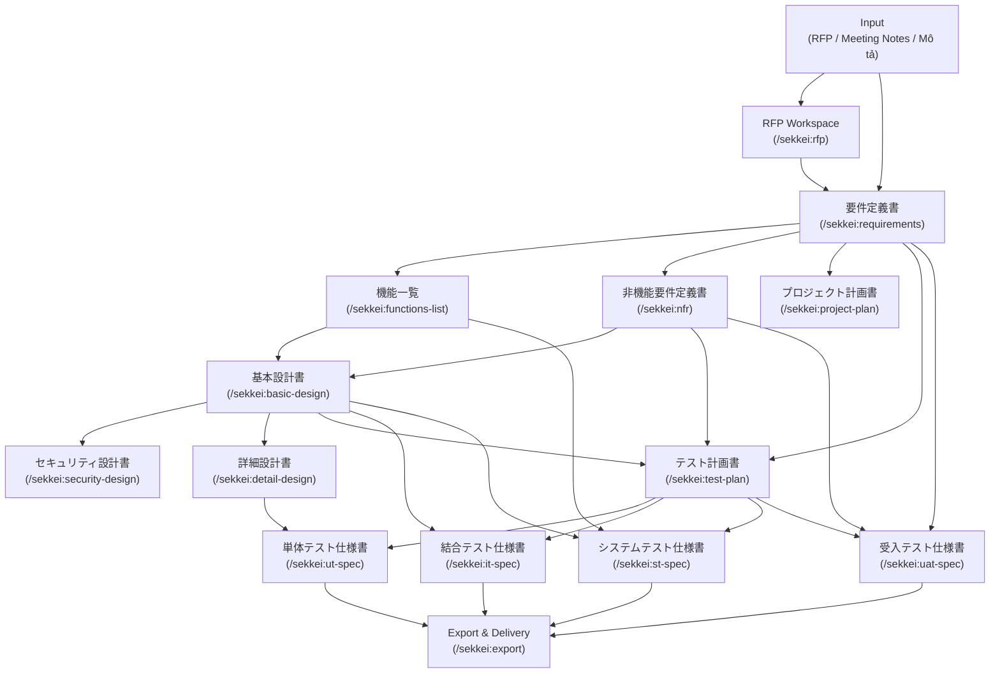

# Workflow Overview — Luồng Dự Án Sekkei

Xem thêm: [Giới thiệu](../introduction.md) | [V-Model & Tài liệu](../v-model-and-documents.md) | [Quick Start](../quick-start.md)

---

## Toàn bộ vòng đời dự án

Một dự án Sekkei bắt đầu từ input của bạn (RFP, meeting notes, hoặc mô tả nghiệp vụ), đi qua ba phase chính — **Yêu cầu → Thiết kế → Test** — và kết thúc bằng việc export bộ tài liệu hoàn chỉnh giao cho khách hàng Nhật. Mỗi tài liệu trong chain đều nhận output của tài liệu trước làm input, tạo ra hệ thống cross-reference IDs (REQ-xxx → F-xxx → SCR-xxx → UT-xxx) xuyên suốt toàn bộ dự án — giúp bạn trace impact khi có thay đổi và validate tính nhất quán trước khi giao hàng.

---

## Sơ đồ toàn bộ dự án

> Mũi tên đứt nét trong `v-model-and-documents.md` biểu thị quan hệ đối ứng test — sơ đồ trên chỉ hiện quan hệ input/output.

---

## Tóm tắt theo phase

| Phase | Tài liệu | Lệnh chính | Thời gian ước tính |
|-------|---------|------------|-------------------|
| **Requirements** | 要件定義書, 機能一覧, 非機能要件定義書, プロジェクト計画書 | `/sekkei:requirements` + 3 lệnh song song | 1–2 ngày |
| **Design** | 基本設計書, セキュリティ設計書, 詳細設計書 | `/sekkei:basic-design` → 2 lệnh song song | 2–4 ngày |
| **Test** | テスト計画書, 単体テスト仕様書, 結合テスト仕様書, システムテスト仕様書, 受入テスト仕様書 | `/sekkei:test-plan` → 4 specs song song | 2–3 ngày |

> Thời gian ước tính với dự án SaaS HR 50–80 tính năng. Dự án nhỏ hơn có thể nhanh hơn 50%.

---

## Tiện ích xuyên suốt dự án

Hai lệnh này bạn sẽ dùng thường xuyên ở mọi phase:

- **`/sekkei:status`** — xem trạng thái toàn bộ chain (tài liệu nào đã xong, tài liệu nào còn pending, tài liệu nào bị broken dependency)
- **`/sekkei:validate`** — kiểm tra tính nhất quán: ID orphaned, section thiếu, cross-reference broken

---

## Điều hướng chi tiết từng phase

| Phase | Tài liệu hướng dẫn |
|-------|-------------------|
| Requirements — 4 tài liệu | [requirements.md](./requirements.md) |
| Design — 3 tài liệu | [design.md](./design.md) |
| Testing — 5 tài liệu | [testing.md](./testing.md) |
| Tài liệu bổ sung — 9 loại | [supplementary.md](./supplementary.md) |
| Change Request lifecycle | [change-request.md](./change-request.md) |

---

**Bắt đầu:** Nếu bạn chưa init project, đọc [Quick Start](../quick-start.md) trước. Sau đó vào [Requirements](./requirements.md) để bắt đầu phase đầu tiên.
