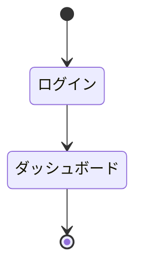

# 画面設計書

## 改訂履歴 <!-- required -->

| 版数 | 日付 | 変更内容 | 変更者 |
|------|------|----------|--------|
| 1.0 | yyyy-mm-dd | 初版作成 | |

## 承認欄 <!-- required -->

| 役割 | 氏名 | 日付 |
|------|------|------|
| 作成者 | | |
| 確認者 | | |
| 承認者 | | |

## 画面一覧 <!-- required -->

| 画面ID | 画面名 | 概要 | 関連API | 備考 |
|--------|--------|------|---------|------|
| SCR-001 | | | | |

## 画面遷移図 <!-- required -->

## コンポーネントカタログ <!-- optional -->

| コンポーネントID | コンポーネント名 | 型 | 用途 | 使用画面 |
|----------------|----------------|-----|------|---------|
| | | | | |

## 画面詳細 — {画面名} (SCR-XXX-001) <!-- required -->

### 画面レイアウト

<!-- AI: Provide a structured YAML layout block (see instructions).
     The YAML will be auto-rendered to a PNG mockup with numbered annotations.
     After rendering, this section will contain an image:  -->

## 画面項目定義

<!-- AI: Define all screen items/fields.
     - 型: text / number / date / select / checkbox / textarea / file / hidden
     - 必須: ○ (required) or blank (optional) -->

| # | 項目ID | 項目名 | 型 | 必須 | 初期値 | 備考 |
|----|--------|--------|-----|------|--------|------|

## バリデーション一覧

<!-- AI: Define validation rules for each input field.
     - タイミング: onBlur / onSubmit / onChange
     - ルール examples: 必須入力, 最大{N}文字, 数値のみ, 日付形式(YYYY-MM-DD) -->

| 項目ID | ルール | メッセージ | タイミング |
|--------|--------|------------|-----------|

## イベント一覧

<!-- AI: List all screen events and their actions.
     - トリガー: ボタンクリック / ページロード / フォーム送信 / etc. -->

| トリガー | アクション | 遷移先/処理 |
|----------|-----------|------------|

## 画面遷移

<!-- AI: Define screen transitions.
     Reference SCR-xxx IDs for source/destination screens. -->

| 遷移元 | 遷移先 | 条件 |
|--------|--------|------|

## API連携 <!-- optional -->

| 画面ID | イベント | API-ID | メソッド | エンドポイント | 備考 |
|--------|---------|--------|---------|-------------|------|
| | | | | | |

## 権限

| ロール | 閲覧 | 編集 | 削除 |
|--------|------|------|------|
