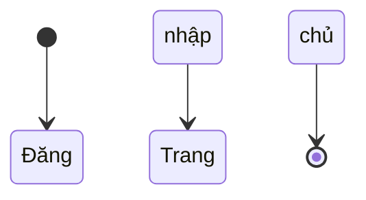

# Tài liệu Thiết kế Màn hình

## Lịch sử sửa đổi <!-- required -->

| Phiên bản | Ngày | Nội dung thay đổi | Người thay đổi |
|-----------|------|-------------------|----------------|
| 1.0 | yyyy-mm-dd | Tạo phiên bản đầu | |

## Phê duyệt <!-- required -->

| Vai trò | Họ tên | Ngày |
|---------|--------|------|
| Người tạo | | |
| Người kiểm tra | | |
| Người phê duyệt | | |

## Danh sách màn hình <!-- required -->

| ID màn hình | Tên màn hình | Tổng quan | API liên quan | Ghi chú |
|------------|-------------|---------|--------------|---------|
| SCR-001 | | | | |

## Sơ đồ chuyển màn hình <!-- required -->

## Danh mục component <!-- optional -->

| ID component | Tên component | Loại | Mục đích | Màn hình sử dụng |
|-------------|--------------|------|---------|----------------|
| | | | | |

## Chi tiết màn hình — {Tên màn hình} (SCR-XXX-001) <!-- required -->

### Bố cục màn hình

<!-- AI: Cung cấp khối YAML bố cục có cấu trúc (xem hướng dẫn).
     YAML sẽ được tự động render thành ảnh PNG với chú thích số.
     Sau khi render, phần này sẽ chứa ảnh:  -->

## Định nghĩa mục màn hình

<!-- AI: Định nghĩa tất cả mục/trường trên màn hình.
     - Loại: text / number / date / select / checkbox / textarea / file / hidden
     - Bắt buộc: ○ (bắt buộc) hoặc để trống (tùy chọn) -->

| # | ID mục | Tên mục | Loại | Bắt buộc | Giá trị mặc định | Ghi chú |
|----|-------|--------|------|---------|----------------|---------|

## Danh sách validation

<!-- AI: Định nghĩa quy tắc validation cho từng trường nhập liệu.
     - Thời điểm: onBlur / onSubmit / onChange
     - Quy tắc ví dụ: bắt buộc, tối đa {N} ký tự, chỉ số, định dạng ngày (YYYY-MM-DD) -->

| ID mục | Quy tắc | Thông báo | Thời điểm |
|-------|---------|----------|----------|

## Danh sách sự kiện

<!-- AI: Liệt kê tất cả sự kiện màn hình và hành động của chúng.
     - Trigger: click nút / tải trang / gửi form / v.v. -->

| Trigger | Hành động | Màn hình chuyển tới/Xử lý |
|---------|----------|------------------------|

## Chuyển màn hình

<!-- AI: Định nghĩa chuyển màn hình.
     Tham chiếu ID SCR-xxx cho màn hình nguồn/đích. -->

| Màn hình nguồn | Màn hình đích | Điều kiện |
|--------------|-------------|---------|

## Liên kết API <!-- optional -->

| ID màn hình | Sự kiện | API-ID | Method | Endpoint | Ghi chú |
|------------|--------|--------|--------|---------|---------|
| | | | | | |

## Phân quyền

| Vai trò | Xem | Chỉnh sửa | Xóa |
|--------|-----|----------|-----|
